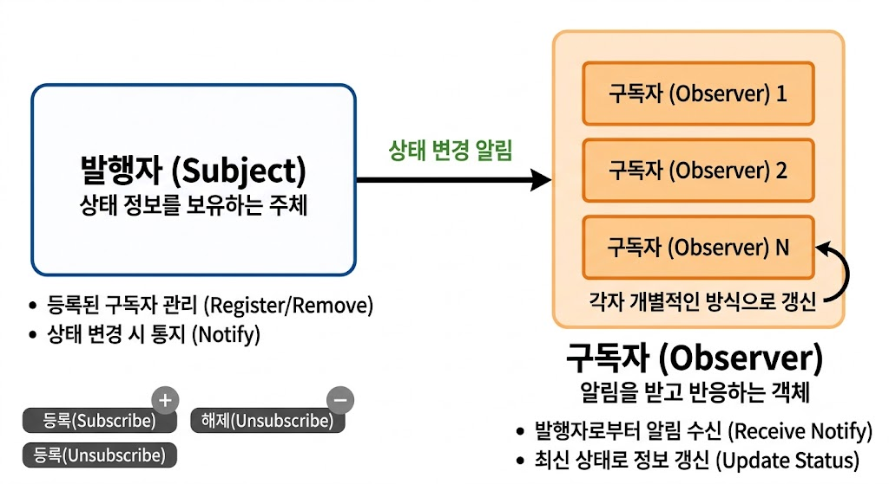

# [Observer Pattern](../KeywordsList.md)

</img>

| **구분** | **핵심 내용** |
| --- | --- |
| **정의** | 1:N 객체 관계에서 상태 변경 시 모든 의존 객체에 자동 알림을 보내는 패턴 |
| **주요 역할** | **Subject**: 상태 보유 및 통지 주체 / **Observer**: 알림을 수신 받아 동작하는 관찰자 |
| **C# 구현체** | `event`, `EventHandler`, `IObservable<T>` / `IObserver<T>` |
| **장점** | 느슨한 결합, 개방-폐쇄 원칙(OCP) 만족, 동적 이벤트 대처 |
| **단점/주의점** | 알림 순서 보장 불가, 미해제 시 메모리 누수 위험, 과도한 사용 시 흐름 추적 어려움 |

## 정의

- 어떤 객체(Subject)의 상태가 변경될 때 그 객체에 의존하는 다른 모든 객체(Observer)들에게 자동으로 알림이 가고 내용이 갱신되도록 만드는 패턴

```csharp
using System;

// 1. 주체(Subject): 상태를 가지고 있으며 변경 시 알림을 보냄
public class WeatherStation
{
    // C#의 event 키워드를 사용한 옵저버 통지 메커니즘
    public event EventHandler<int> TemperatureChanged;

    private int _temperature;

    public int Temperature
    {
        get => _temperature;
        set
        {
            if (_temperature != value)
            {
                _temperature = value;
                Notify(_temperature); // 온도 변화 시 알림
            }
        }
    }

    protected virtual void Notify(int temp)
    {
        TemperatureChanged?.Invoke(this, temp);
    }
}

// 2. 옵저버(Observer): 주체의 상태 변화를 통보받아 처리
public class PhoneDisplay
{
    private string _name;

    public PhoneDisplay(string name)
    {
        _name = name;
    }

    public void OnTemperatureChanged(object sender, int temp)
    {
        Console.WriteLine($"[{_name}] 알림 수신: 현재 기온은 {temp}도 입니다.");
    }
}

// 실행 코드
class Program
{
    static void Main(string[] args)
    {
        WeatherStation station = new WeatherStation();
        
        PhoneDisplay display1 = new PhoneDisplay("철수의 폰");
        PhoneDisplay display2 = new PhoneDisplay("영희의 폰");

        // 구독 (가입)
        station.TemperatureChanged += display1.OnTemperatureChanged;
        station.TemperatureChanged += display2.OnTemperatureChanged;

        // 상태 변경 -> 자동으로 옵저버들에게 통지됨
        Console.WriteLine("--- 날씨 업데이트 시작 ---");
        station.Temperature = 25; 
        
        station.Temperature = 28;
    }
}
```

## 기능

- **구독 및 해제 등록** : 관찰 대상(Subject)에 통지를 받고 싶은 옵저버를 추가하거나 삭제.
- **자동 알림 통지** : Subject의 상태가 바뀌는 순간, 등록된 모든 Observer의 갱신 메서드를 일괄 호출.
- **데이터 전달** : 상태 변경 시 변경된 데이터(Push 방식) 또는 상태 자체(Pull 방식)를 옵저버에게 전달.

## 특징

- **느슨한 결합(Loose Coupling)** : Subject는 Observer의 구체적인 클래스를 알 필요 없이 인터페이스만 참조.
- **개방-폐쇄 원칙(OCP) 준수** : 기존 코드 수정 없이 새로운 Observer 클래스를 자유롭게 추가할 수 있음.
- **동적 관계 구축** : 실행 시간(Runtime) 중에 관찰 대상을 등록하거나 해제할 수 있음.

## 알아두면 좋을 내용

- **인터페이스 기반 Classic 방식** : GoF의 표준 구조로 `ISubject`, `IObserver` 인터페이스를 직접 구현.
- **`event` / `delegate` 활용 방식** : C# 개발자들이 가장 흔히 쓰는 방식으로, 인터페이스 선언 없이 `event` 키워드 하나로 간단하게 구독/해제를 처리.
- **.NET 표준 인터페이스 (`IObservable<T>` / `IObserver<T>`)** : .NET BCL에서 기본 제공하는 인터페이스로, Reactive Extensions(Rx)와 연동할 때 표준으로 사용.