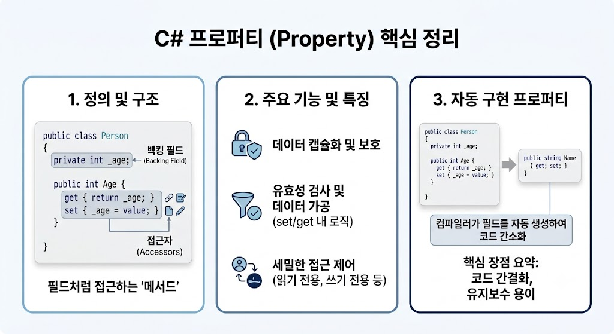

# [Property](../KeywordsList.md)

</img>

| **구분** | **주요 내용** |
| --- | --- |
| **정의** | 필드의 접근을 제어하기 위해 `get`과 `set` 접근자를 제공하는 클래스 멤버 |
| **주요 역할** | 데이터 캡슐화 보호, 값 검증 및 계산 로직 제공, 데이터 은닉성 유지 |
| **주요 특징** | 변수 같은 사용법, 컴파일 시 내부 메서드 변환, 인터페이스 선언 가능 |
| **자동 구현** | `public int Age { get; set; }` 형태로 백킹 필드 자동 생성 |
| **최신 문법** | `init` 접근자(생성 시점 불변성 제공), 식 본문 표상(`=>`) 간소화 |

## 정의

- 클래스의 필드(Field)에 안전하게 접근하고 값을 제어할 수 있도록 돕는 멤버
- 내부적으로는 메소드처럼 동작하지만, 외부에서는 변수(필드)처럼 직관적인 문법으로 사용할 수 있게 설계
- 개체 내부의 private 필드 값을 읽거나(`get`), 새로운 값을 할당(`set`)하기 위한 접근자(Accessor)의 집합

```csharp
public class Person
{
    // 백킹 필드 (Backing Field)
    private int age;

    // 프로퍼티 정의
    public int Age
    {
        get { return age; } // 값을 읽을 때 호출
        set                  // 값을 쓸 때 호출 (value 키워드 사용)
        {
            if (value >= 0)
                age = value;
        }
    }
}
```

## 기능

- **캡슐화(Encapsulation) 유지가 핵심 역할** : 클래스 내부 데이터(필드)를 직접 외부에 노출하지 않고 `private`으로 보호하면서, 프로퍼티를 통해서만 안전하게 접근하도록 제한.
- **유효성 검사 및 로직 추가** : `set` 접근자 내부에서 잘못된 값이 입력되는 것을 방지하거나, `get` 접근자에서 값을 가공하여 반환할 수 있음.
- **접근 권한 차등 부여** : `get`과 `set`의 접근 제한자를 다르게 설정하여 읽기 전용 또는 특정 범위 내에서만 변경 가능한 프로퍼티를 만들 수 있음.

## 특징

- **필드와 같은 문법** : `person.Age = 25;`나 `int myAge = person.Age;`처럼 메서드 호출 괄호 `()` 없이 일반 변수처럼 다룸.
- **메소드로의 컴파일** : C# 컴파일러는 프로퍼티를 실행할 때 내부적으로 `get_Age()` 및 `set_Age()` 형태의 MSIL 메소드로 변환하여 실행.
- **인터페이스 구현 가능** : 필드는 인터페이스 선언에 포함될 수 없지만, 프로퍼티는 인터페이스에 선언하여 클래스들이 해당 규격을 구현하도록 유발할 수 있음.

## 알아두면 좋을 내용

### ① 자동 구현 프로퍼티 (Auto-Implemented Property)

- 별도의 검증 로직 없이 단순 읽기/쓰기만 수행할 경우, 백킹 필드를 직접 선언할 필요 없이 한 줄로 짧게 작성할 수 있음.

```csharp
public string Name { get; set; } // 컴파일러가 알아서 익명의 private 필드를 생성함
```

### ② 읽기 전용 프로퍼티 및 `init` 접근자 (C# 9.0+)

- **읽기 전용** : `get`만 선언하면 외부에서 값을 수정할 수 없는 읽기 전용 프로퍼티가 됨.
- **`init` 접근자** : 객체가 생성되는 시점(생성자 또는 객체 리터럴 초기화)에만 값을 할당할 수 있고, 이후에는 변경할 수 없게 만듦.

```csharp
public string ID { get; init; } // 생성 시점에만 값 설정 가능 (불변성 보장)
```

### ③ 식 본문 표상 (Expression-bodied Properties)

- 람다 화살표(`=>`)를 사용하여 읽기 전용 프로퍼티나 단문 프로퍼티를 간결하게 작성 가능.

```csharp
public string FullName => $"{FirstName} {LastName}";
```