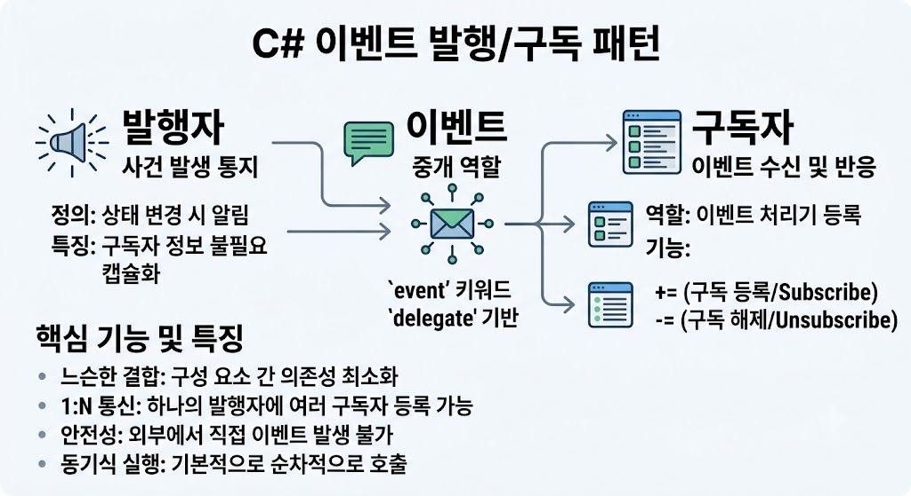

# [event - 발행/구독 패턴](../KeywordsList.md)

</img>

| **구분** | **개념 및 설명** | **C#에서의 역할 / 연산자** |
| --- | --- | --- |
| **Publisher (발행자)** | 상태 변화 발생 시 이벤트를 알리는 주체 | `event` 키워드로 이벤트 선언 및 `Invoke()` 호출 |
| **Subscriber (구독자)** | 이벤트 발생 소식을 받아 로직을 수행하는 주체 | `+=` (구독), `-=` (구독 해제) 연산자 사용 |
| **Delegate (대리자)** | 이벤트와 구독자 메서드를 연결하는 타입 안전한 콜백 | 이벤트의 시그니처 정의 (예: `EventHandler<T>`) |
| **장점** | 시스템 간 느슨한 결합(Loose Coupling) 및 높은 확장성 | 객체 간 독립적인 개발 및 유지보수 가능 |
| **주의점** | 메모리 누수 위험, 동기식 순차 실행 | 구독 해제(`-=`) 필수, 예외 처리 구문 필요 |

## 정의

- 특정 사건(Event)의 발생을 여러 객체에 전파할 수 있는 강력한 디자인 패턴
- 발행자(Publisher) 객체가 특정 상태 변화나 조건 만족 시 이벤트를 발생시키고, 이를 감지하고자 하는 구독자(Subscriber) 객체들이 해당 이벤트에 함수(이벤트 핸들러)를 등록해 두었다가 자동으로 통지받아 처리하는 구조
    - **발행자(Publisher) :** 사건이 발생했음을 알리는 객체. 어떤 구독자가 자신을 듣고 있는지 알 필요 없이 이벤트를 방출(Raise/Fire)
    - **구독자(Subscriber) :** 특정 사건에 관심이 있어 반응하려는 객체. 발행자의 이벤트를 구독하고, 이벤트 발생 시 실행될 이벤트 처리기(Event Handler)를 등록.

## 기능

- `event`는 내부적으로 다중 캐스트 델리게이트(Multicast Delegate)를 캡슐화한 구조.
    - **구독 (`+=` 연산자) :** 구독자는 발행자의 이벤트에 자신의 메서드를 등록.
    - **해제 (`-=` 연산자) :** 더 이상 이벤트를 받을 필요가 없을 때 수신 등록을 취소.
    - **발행 (`Invoke` / `?.` 연산자) :** 발행자 내부에서 특정 조건이 만족되면 등록된 모든 구독자의 메서드를 순차적으로 호출.

## 특징

- **느슨한 결합(Loose Coupling) :** 발행자와 구독자는 서로의 구체적인 타입이나 내부 동작을 몰라도 됨. 오직 이벤트의 시그니처(매개변수 및 반환 타입)만 공유.
- **캡슐화 및 안전성 :** `delegate`를 외부에 `public`으로 공개하면 외부에서 임의로 이벤트를 발생시키거나(`Invoke`), 기존 구독자 목록을 덮어쓰는(`=`) 치명적인 오류가 생길 수 있음. `event` 키워드를 붙이면 외부 클래스에서는 오직 구독(`+=`)과 해제(`-=`)만 가능하도록 제약됨.
- **1:N 통신 :** 하나의 발행자 이벤트에 여러 개의 구독자가 동시 등록되어 통지를 받을 수 있음.

```csharp
using System;

// 1. 이벤트 데이터 클래스 정의
public class OrderEventArgs : EventArgs
{
    public int OrderId { get; }
    public OrderEventArgs(int orderId) => OrderId = orderId;
}

// 2. 발행자 (Publisher)
public class OrderService
{
    // C# 표준 EventHandler<TEventArgs> 델리게이트 활용
    public event EventHandler<OrderEventArgs>? OrderCompleted;

    public void CompleteOrder(int orderId)
    {
        Console.WriteLine($"[OrderService] 주문 #{orderId} 완료 처리 중...");
        
        // 안전한 이벤트 호출 (Null-conditional operator 사용)
        OnOrderCompleted(new OrderEventArgs(orderId));
    }

    protected virtual void OnOrderCompleted(OrderEventArgs e)
    {
        OrderCompleted?.Invoke(this, e);
    }
}

// 3. 구독자 (Subscriber)
public class EmailNotifier
{
    public void OnOrderCompleted(object? sender, OrderEventArgs e)
    {
        Console.WriteLine($"[EmailNotifier] 주문 #{e.OrderId} 안내 이메일을 발송했습니다.");
    }
}

// 4. 실행
class Program
{
    static void Main()
    {
        var publisher = new OrderService();
        var subscriber = new EmailNotifier();

        // 구독 등록 (+=)
        publisher.OrderCompleted += subscriber.OnOrderCompleted;

        // 이벤트 발생
        publisher.CompleteOrder(101);

        // 구독 해제 (-=)
        publisher.OrderCompleted -= subscriber.OnOrderCompleted;
    }
}
```

## 알아두면 좋을 내용

- **메모리 누수 (Lapsed Listener Problem):** 구독자 객체가 수명이 다했음에도 발행자의 이벤트를 해제(`-=`)하지 않으면, 발행자가 구독자의 참조를 유지하게 되어 가비지 컬렉터(GC)가 구독자를 메모리에서 해제하지 못합니다. 필요가 없어진 이벤트는 반드시 `IDisposable` 패턴 등을 통해 해제해야 합니다.
- **동기식 실행 주의:** 기본 `event` 호출 방식은 구독자들의 메서드를 동기적(Synchronous)으로 순차 실행합니다. 특정 구독자의 로직이 병목이 되거나 예외를 던지면 후속 구독자가 영향을 받을 수 있으므로, 예외 처리 및 비동기 패턴(`Task`) 고려가 필요합니다.
- **`EventHandler` 및 `EventHandler<TEventArgs>`:** C# .NET 표준 권장 사항으로, 직접 custom `delegate`를 정의하기보다는 .NET 표준 `EventHandler` 타입 사용이 권장