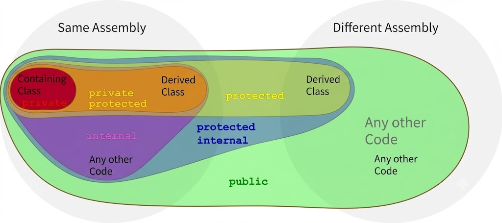

# [Public](../KeywordsList.md)

</img>

| **구분** | **내용** |
| --- | --- |
| **정의** | 프로그램 전체에서 접근 제한 없이 사용할 수 있도록 허용하는 가장 개방적인 접근 제한자 |
| **주요 역할** | 외부 모듈/클래스와의 상호작용을 위한 공개 인터페이스(API) 제공 및 멤버 노출 |
| **접근 범위** | 동일 클래스 / 동일 어셈블리(프로젝트) 내부 / 외부 어셈블리까지 전역 접근 가능 |
| **권장 사용처** | 클래스의 외부 공개 기능(메서드), 프로퍼티, 라이브러리의 공개 API |
| **주의 사항** | 데이터(필드)를 무분별하게 `public`으로 선언하면 캡슐화가 깨지므로 프로퍼티 활용 권장 |

## 정의

- 선언된 멤버에 대해 어떤 제한도 없이 완전한 접근을 허용하는 접근 제한자
- 동일한 어셈블리(프로젝트) 내부는 물론이고, 외부 어셈블리에서도 해당 멤버를 자유롭게 참조하고 호출 가능
- 클래스, 메서드, 프로퍼티, 변수 등의 접근 제한자(Access Modifier) 중 하나로, 코드의 가시성과 캡슐화를 제어하는 핵심적인 역할

## 기능

- **전역 가시성 제공 :** 프로그램 전체 어디서든 해당 객체나 멤버에 접근할 수 있는 경로를 열어줌.
- **API 및 인터페이스 정의 :** 외부 라이브러리나 다른 모듈과 소통하기 위한 공개 인터페이스(Public API)를 구축할 때 필수적으로 사용됨.
- **상속 시 멤버 노출 :** 부모 클래스의 `public` 멤버는 자식 클래스에서 별도의 제약 없이 그대로 상속받아 사용할 수 있다.

## 특징

- **가장 개방적인 수준 :** C#의 접근 제한자(`private`, `protected`, `internal`, `private protected`, `protected internal`, `public`) 중 ****가장 개방적.
- **인터페이스(Interface)의 기본값 :** 인터페이스 내부에 선언되는 모든 메서드와 프로퍼티는 기본적으로 `public` 속성을 지닙니다 (명시적으로 키워드를 쓰지 않아도 공용으로 동작).

## 추가 정보

- **캡슐화(Encapsulation) 위배 주의 :** 모든 데이터를 `public`으로 선언하면 외부에서 객체의 내부 상태를 제어 없이 직접 변경할 수 있게됨. 이는 객체지향 프로그래밍의 핵심 원칙인 캡슐화를 무너뜨리고, 버그를 추적하기 어렵게 만든다. 데이터(필드)는 주로 `private`으로 숨기고, 필요할 경우 `public` 프로퍼티(Property)를 통해 안전하게 접근하도록 설계하는 것이 좋음.
- **`internal`과의 차이점 :**`public`은 외부 어셈블리(다른 프로젝트나 DLL)에서도 접근할 수 있는 반면, `internal`은 오직 현재 프로젝트(어셈블리) 내부에서만 접근 가능. 라이브러리를 만들 때 외부 사용자에게 공개할 기능만 `public`으로 지정하고, 내부 로직은 `internal`로 감추는 것이 좋은 설계.