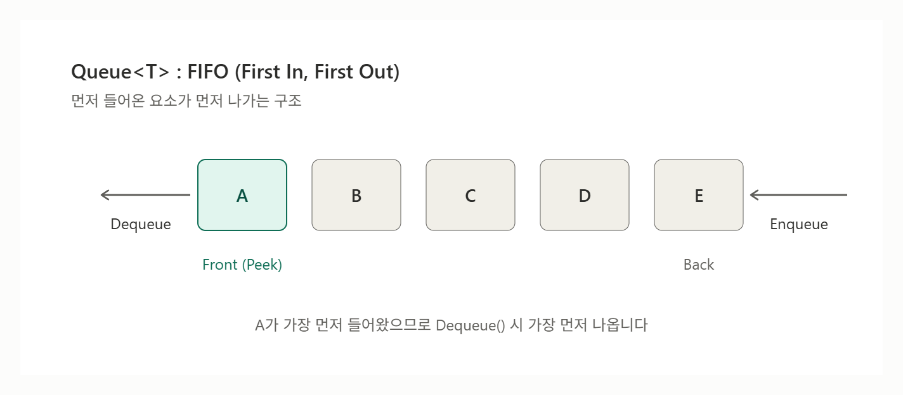

# [Queue](../KeywordsList.md)

</img>

| **항목** | **내용** |
| --- | --- |
| **정의** | FIFO 방식의 제네릭 컬렉션 (`Queue<T>`) |
| **핵심 메서드** | `Enqueue`, `Dequeue`, `Peek`, `TryDequeue`, `TryPeek` |
| **내부 구조** | 순환 배열 |
| **시간 복잡도** | `Enqueue` 평균 O(1), `Dequeue`/`Peek` O(1), `Contains` O(n) |
| **제한 사항** | 인덱서 없음, 스레드 안전하지 않음, 빈 큐에서 `Dequeue`/`Peek` 시 예외 |
| **대안** | 동시성: `ConcurrentQueue<T>`, 우선순위: `PriorityQueue`, 역순(LIFO): `Stack<T>` |
| **주요 용도** | 대기열, BFS, 이벤트·메시지 처리, 버퍼링 |

## 정의

- `System.Collections.Generic` 네임스페이스에 있는 컬렉션 클래스
- 먼저 들어간 요소가 먼저 나오는 FIFO(First In, First Out) 방식으로 동작
- `System.Collections.Queue`라는 비제네릭 버전도 있음. 이 버전은 `object`로 저장하므로 박싱·언박싱 비용과 타입 안전성 문제가 있어서, 새 코드에서는 `Queue<T>`를 쓰는 것이 일반적.

## 특징

- FIFO 구조 : 요소는 맨 뒤로 들어가고 맨 앞에서 나감.
- 제네릭 타입 안전성 : 지정한 타입만 담을 수 있고 박싱이 없음.
- 내부 구현 : 순환 배열(circular array)을 사용. 그래서 앞에서 꺼내도 요소를 한 칸씩 당기지 않아 빠름.
- 시간 복잡도
    - `Enqueue`는 평균 O(1)이고, 내부 배열이 가득 차 재할당될 때만 O(n).
    - `Dequeue`와 `Peek`는 O(1).
    - `Contains`는 O(n).
- 인덱서 : 인덱스가 없어 `queue[0]`처럼 임의 접근을 할 수 없음.
- 중복과 `null`을 허용(참조 타입의 경우).
- 스레드 : 여러 스레드에서 동시에 쓰면 안 됩니다.
- `foreach`로 순회해도 요소가 제거되지 않고, front → back 순서로 열거.
- 순회 중에 큐를 수정하면 `InvalidOperationException`이 발생.

## 기능

```csharp
using System.Collections.Generic;

Queue<string> queue = new Queue<string>();

queue.Enqueue("A");            // 뒤에 추가
queue.Enqueue("B");
queue.Enqueue("C");

string peek = queue.Peek();    // "A" (제거하지 않고 확인)
string first = queue.Dequeue();// "A" (꺼내면서 제거)

Console.WriteLine(queue.Count);        // 2
Console.WriteLine(queue.Contains("B")); // True

if (queue.TryDequeue(out string item)) // 안전하게 꺼내기
    Console.WriteLine(item);           // "B"

queue.Clear();                 // 전체 삭제
```

| 멤버 | 설명 |
| --- | --- |
| `Enqueue(T)` | 큐의 맨 뒤에 요소를 추가 |
| `Dequeue()` | 맨 앞 요소를 반환하고 제거 (비어 있으면 예외) |
| `Peek()` | 맨 앞 요소를 제거하지 않고 반환 (비어 있으면 예외) |
| `TryDequeue(out T)` / `TryPeek(out T)` | 예외 없이 `bool`로 성공 여부를 반환 (.NET Core 2.0 이상, Unity 최신 버전 등) |
| `Count` | 현재 요소 개수 |
| `Contains(T)` | 특정 요소 포함 여부 확인 |
| `Clear()` | 모든 요소 제거 |
| `ToArray()` / `CopyTo()` | 배열로 복사 (front → back 순서) |
| `TrimExcess()` | 남는 내부 용량을 줄여 메모리 절약 |
- 생성자 : 기본 생성자, 초기 용량을 지정하는 `new Queue<T>(int capacity)`, 기존 컬렉션으로 초기화하는 `new Queue<T>(IEnumerable<T>)`

## 알아두면 좋은 내용

### 사용 예시

- 작업/요청 대기열(프린터 스풀, 서버 요청 처리)
- 너비 우선 탐색(BFS)
- 이벤트/메세지 큐, 입력 버퍼
- 순서대로 처리해야 하는 데이터 스트림

### 비슷한 자료구조와의 비교

- Stack<T> : LIFO. Push/Pop을 사용
- `PriorityQueue<TElement, TPriority>` (.NET 6 이상) : 우선순위가 가장 높은(값이 작은) 요소부터 나옴.
- `Deque`(양방향 큐) : 기본 제공 X. 필요하면 `LinkedList<T>`로 대체하거나 직접 구현해야 함.

### 주의할 점

- 빈 큐에서 `Dequeue()`나 `Peek()`를 호출하면 `InvalidOperationException`이 발생. `Count > 0`을 확인하거나 `TryDequeue()`/`TryPeek()` 사용 권장.
- 멀티스레드 환경에서는 `ConcurrentQueue<T>` (`System.Collections.Concurrent`)를 권장. 생산자-소비자 패턴이라면 `BlockingCollection<T>`나 `Channel<T>`도 좋은 선택.
- 요소 수를 대략 알고 있다면 생성자에 초기 용량을 지정해 재할당 비용을 줄일 수 있음.
- 특정 요소를 중간에서 삭제하거나 인덱스로 접근해야 한다면 `Queue`가 적합하지 않음. 이럴 땐 `List<T>`나 `LinkedList<T>`를 고려해야 함.