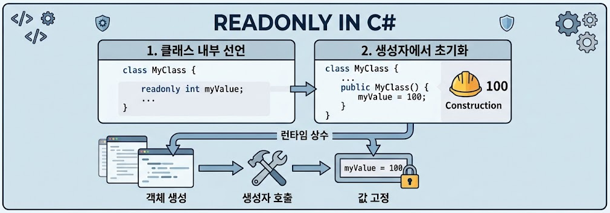
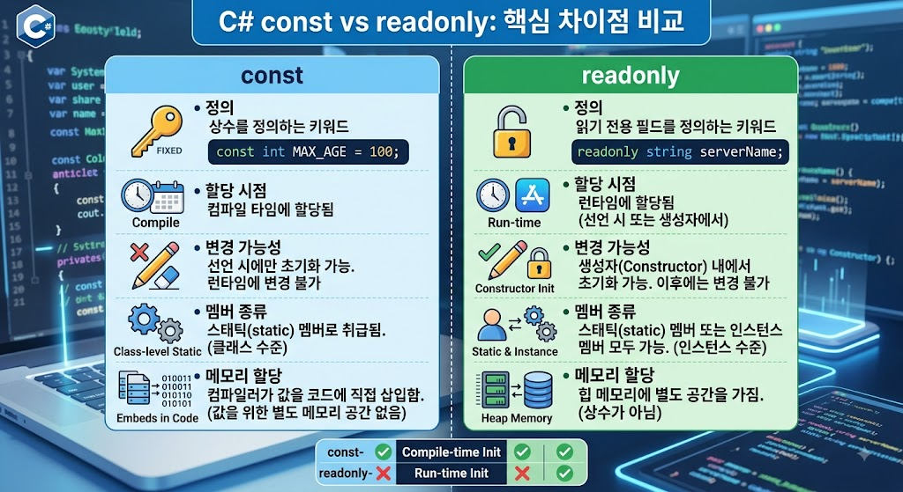

# [ReadOnly](../KeywordsList.md)

</img>

| **구분** | **readonly (읽기 전용)** |
| --- | --- |
| **평가 시점** | 런타임 (Run-time) |
| **초기화 시점** | 선언 시 또는 생성자(Constructor) 내부 |
| **`static` 여부** | `static`을 붙여야 클래스 레벨 사용 가능 |
| **사용 가능 타입** | 모든 타입 (참조형, 사용자 정의 객체 등 가능) |
| **주요 용도** | 객체마다 달라질 수 있으나 생성 후 안 변하는 값 |

## 정의

- 런타임 상수(Run-time Constant)를 정의하는 키워드
- 필드(Field)에 선언하여, 해당 필드가 오직 선언된 시점 혹은 생성자(Constructor) 내부에서만 값을 할당받을 수 있으며 그 이후에는 변경할 수 없는 읽기 전용 상태가 되도록 보장.

```csharp
public class User
{
    public readonly string Id; // readonly 필드 선언
    
    public User(string id)
    {
        Id = id; // 생성자에서 초기화 가능
    }
}
```

## 기능

- **동적 초기화 지원 :** 컴파일 타임에 값을 확정해야 하는 `const`와 달리, 프로그램 실행 중(런타임) 객체가 생성될 때 외부에서 전달받은 값이나 계산된 값으로 상수를 초기화할 수 있다.
- **객체 상태의 안정성 보장 :** 한번 초기화된 필드는 프로그램의 다른 메서드나 외부 코드에서 절대 값을 바꿀 수 없으므로, 데이터의 무결성(Integrity)과 객체의 불변성을 유지하는 데 핵심적인 역할.
- **인스턴스별 고유 값 허용 :** `readonly`는 인스턴스마다 다른 값을 가질 수 있어 객체 지향 프로그래밍에서 각 객체의 고유한 상태를 보호하기에 적합.

## 특징

1. 초기화할 수 있는 위치가 제한적
    - 필드 선언 시점( `= 값` 형태) 또는 해당 클래스의 생성자 내부에서만 값을 대입할 수 있음. 그 외의 메서드나 프로퍼티에서는 값을 변경할 수 없음.
2. 참조 타입(Reference Type)과 함께 사용 시 주의가 필요
    - `readonly`는 변수(참조) 자체를 고정하는 것이지, 참조하는 객체 내부의 데이터까지 변경 불가능하게 만드는 것은 아님**.** 예를 들어 `readonly`로 선언된 리스트(`List<T>`) 객체 자체를 다른 리스트로 교체할 수는 없지만, 리스트 내부의 요소를 `Add`나 `Remove`로 수정하는 것은 가능.
3. **`static readonly`** 조합이 가능
    - `readonly` 앞에 `static`을 붙여 클래스 레벨(공용)의 런타임 상수로 만들 수 있음. (예: `public static readonly DateTime StartTime = DateTime.Now;`)

## Const와의 차이점

</img>