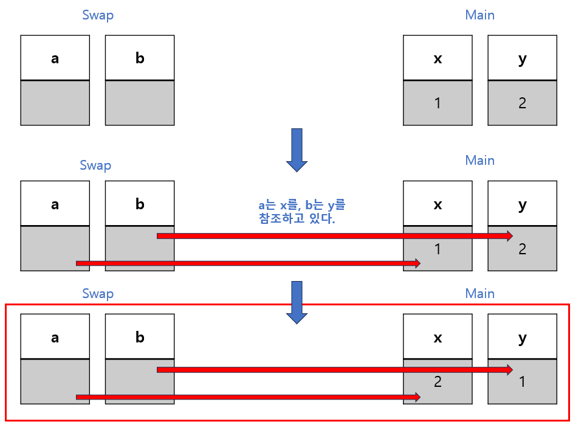

# [Ref](../KeywordsList.md)

</img>

| **구분** | **주요 내용** |
| --- | --- |
| **정의** | 변수의 복사본이 아닌 메서드로 원본 변수의 메모리 참조(주소)를 전달하는 한정자 |
| **주요 역할** | 메서드 내부에서 원본 변수의 값을 직접 읽고 수정(갱신)할 수 있도록 지원 |
| **변수 초기화** | 필수 (메서드 호출 전 반드시 값이 할당되어 있어야 함) |
| **메서드 내 값 할당** | 선택 (메서드 내부에서 반드시 값을 바꾸지 않아도 컴파일 에러 안 남) |
| **구문 규칙** | 메서드 정의부와 호출부 양쪽 모두에 `ref` 키워드를 작성해야 함 |
| **`out`과의 차이** | `ref`는 입출력 겸용(초기화 필수), `out`은 순수 출력 전용(호출 전 초기화 불필요) |

## 정의

- 메서드에 인자를 전달할 때 값에 의한 전달(Pass by Value) 대신 참조에 의한 전달(Pass by Reference)을 수행하도록 지정하는 역할
- 실제 변수의 메모리 주소(참조)를 직접 전달
- 메서드 내부에서 해당 매개변수의 값을 변경하면, 메서드를 호출한 원본 변수의 값도 함께 변경

## 기능

- **원래 변수 직접 수정 :** 메서드 내부에서 전달받은 매개변수 값을 바꾸면 호출한 곳의 원본 변수 데이터가 즉시 갱신됨.
- **값 타입(Struct, int 등)의 참조 전달 :** 스택(Stack) 메모리에 복사본을 생성하는 대신 원본 메모리를 직접 가리키게 하여 메모리 복사 비용을 줄이고 데이터 변경을 동기화.
- **참조 타입(Class, string 등)의 참조 자체 변경 :** 참조 타입 변수를 `ref`로 전달하면, 메서드 내부에서 `new` 키워드로 새 객체를 할당했을 때 호출부의 원본 변수가 바라보는 객체 자체가 바뀌게 됨.

## 특징

### ① 초기화 필수

- `ref` 매개변수로 전달하는 변수는 메서드를 호출하기 전에 반드시 초기화되어 있어야 함.
- 컴파일러는 `ref` 매개변수가 메서드 진입 시점에 이미 유효한 값을 가지고 있다고 가정하기 때문.

```csharp
int number; // 초기화되지 않음!
// Square(ref number); // 에러 발생

int validNumber = 10; // 초기화 완료
Square(ref validNumber); // 정상 작동
```

### ② 호출할 때와 정의할 때 모두 작성

- 메서드 선언부뿐만 아니라 호출하는 곳에서도 `ref` 키워드를 반드시 명시해야 함(이는 코드를 읽는 사람에게 이 변수는 값이 변경될 수 있음을 명시적으로 알려주는 역할)

```csharp
void Swap(ref int num1, ref int num2)//선언
{
	...
}
...
int x=5;
Swap(ref x); //호출 시에도 ref 명시
```

## 대표적인 코드 예시

```csharp
using System;

class Program
{
	static void Swap(ref int a, ref int b)
	{
		int temp = a;
		a = b;
		b = temp;
	}
	
	static void Main()
	{
		int x = 10;
		int y = 20;
		
		Console.WriteLine($"스왑 전 a : {a}, b : {b}");
		
		Swap(ref x, ref y);
		
		Console.WriteLine($"스왑 후 a : {a}, b : {b}");	
	}
}
```