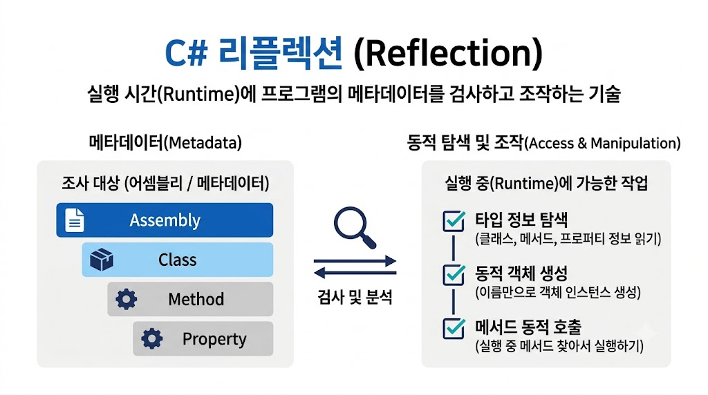

# [리플렉션(Reflection)](../KeywordsList.md)

</img>

| **구분** | **주요 내용** |
| --- | --- |
| **정의** | 런타임에 프로그램의 메타데이터(타입, 메서드 등)를 조사하고 조작하는 기능 (`System.Reflection`) |
| **주요 기능** | 타입 정보 조회, 동적 인스턴스 생성, 메서드/프로퍼티 동적 호출, 어트리뷰트 읽기, 어셈블리 로드 |
| **장점** | 뛰어난 유연성, 플러그인 구조 구현 가능, DI 및 ORM 등 프레임워크의 근간 제공 |
| **단점** | 느린 실행 성능, 컴파일 타임 타입 체크 불가, 캡슐화(private 접근 등) 우회 위험 |
| **주의 사항** | 반복 호출 시 반드시 캐싱 적용, 성능이 민감하다면 식 트리나 소스 제너레이터 고려 |

## 정의

- 프로그램이 실행 중(Runtime)에 자신의 구조와 데이터(메타데이터)를 조사하고 조작할 수 있는 강력한 기능
- 컴파일 타임에 어떤 클래스나 메서드가 있는지 구체적으로 알지 못해도, 런타임에 동적으로 타입을 파악하고 활용할 수 있게 해줌
- 어셈블리(Assembly), 모듈(Module), 타입(Type) 등의 메타데이터를 검사하고 상호 작용할 수 있는 기능
- .NET 환경에서는 `System.Reflection` 네임스페이스를 통해 제공되며, 코드가 스스로를 검사하고 실행 중에 객체를 제어할 수 있는 기반이 됨

## 기능

- **타입 정보 조회 (`Type` 탐색) :** 특정 클래스의 이름, 상속 관계, 인터페이스, 접근 제한자 등의 메타데이터를 가져옴. (`typeof(T)` 또는 `object.GetType()`)
- **동적 객체 생성 :** 클래스 이름을 문자열 등으로 동적으로 받아 `Activator.CreateInstance()`를 통해 런타임에 인스턴스를 생성.
- **멤버 호출 및 제어 :** 객체의 프로퍼티, 필드, 메서드, 이벤트 등을 런타임에 찾아내어 값을 읽거나 쓰고, 메서드를 직접 호출 가능 (`MethodInfo.Invoke()`).
- **어트리뷰트(Attribute) 읽기 :** 코드에 선언된 커스텀 어트리뷰트 정보를 추출하여 프레임워크 설정이나 유효성 검증 등에 활용 (예: ASP.NET Core의 라우팅 및 모델 바인딩).
- **어셈블리 동적 로드 :** 외부 DLL 파일을 프로그램 실행 중에 로드(`Assembly.LoadFrom`)하여 내부에 포함된 타입을 꺼내 쓸 수 있음 (플러그인 아키텍처의 핵심).

## 특징

- **높은 유연성과 확장성 :** 컴파일 시점에 결정되지 않은 타입이나 기능을 런타임에 연결할 수 있어 플러그인 시스템, DI(의존성 주입) 컨테이너, ORM(Entity Framework 등) 구현에 필수적.
- **동적 프로그래밍 :** 메타데이터를 기반으로 제네릭한(Generic) 범용 라이브러리나 프레임워크를 작성 가능
- **성능 저하 :** 런타임에 타입과 멤버를 탐색하고 검증하는 과정이 포함되므로, 일반적인 코드 직접 호출 방식보다 성능이 현저히 떨어짐.
- **타입 안정성(Type Safety) 저하 :** 컴파일 시점에 오류를 잡아내지 못하고, 런타임에 `NullReferenceException`이나 `TargetInvocationException` 같은 예외가 발생 가능.
- **캡슐화 위반 :** `private`으로 선언된 필드나 메서드에도 접근할 수 있어 객체지향의 캡슐화 원칙 위배 가능

## 알아두면 좋을 내용

- **성능 최적화 (캐싱) :** 리플렉션 연산(`Type.GetMethod` 등)은 비용이 매우 큼. 따라서 반복문 안에서 매번 리플렉션을 호출하는 것은 피해야 하며, 최초 조회 시 `Type`이나 `MethodInfo`를 캐싱(Static 변수나 딕셔너리 등에 저장)해두고 재사용해야 성능을 지킬 수 있음.
- **대체 기술 - 식 트리(Expression Trees) :** 리플렉션의 성능 저하를 극복하기 위해 `System.Linq.Expressions`를 활용해 런타임에 컴파일 가능한 코드를 동적으로 생성하면 리플렉션보다 훨씬 빠른 속도로 메서드를 호출 가능.
- **최신 트렌드 - 소스 제너레이터(Source Generator) :** 최근 .NET(.NET 5 이후부터 활성화)에서는 런타임 리플렉션의 성능 단점을 보완하기 위해, 컴파일 타임에 코드를 미리 생성해 주는 소스 제너레이터 기술(예: `System.Text.Json`의 소스 생성기)이 적극 권장됨.