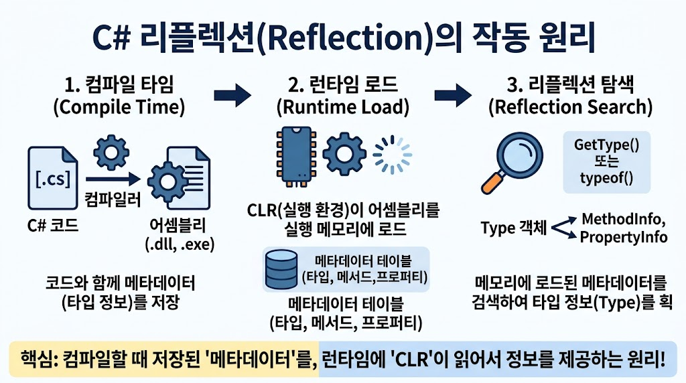

# [Reflection 추가](../KeywordsList.md)

## 런타임에서 타입 정보를 가져오는 원리

</img>

### 1. 컴파일 타임: 메타데이터 생성

- C# 코드를 컴파일 하면 C# 컴파일러는 소스코드를 두 가지 요소로 변환하여 IL(중간 언어) 파일(PE 파일, `.exe` 또는 `.dll)`로 저장함.
    - CIL 코드(Common Intermediate Language) : 메서드 내의 실제 실행 로직
    - 메타데이터 : 프로그램 구조에 대한 데이터
        - 데이터 베이스 테이블 형태로 기록됨
        - 정의된 타입의 이름, 네임스페이스, 접근 제한자
        - 상속한 클래스 및 구현한 인터페이스
        - 메서드, 프로퍼티, 필드, 이벤트의 이름, 타입, 매개변수 정보
        - 적용된 사용자 지정 특성

### 2. 메타데이터의 저장 구조

- PE 파일 내부의 메타데이터 헤더 아래에는 체계화된 여러 표준 테이블이 존재함
- `TypeDef` 테이블 : 클래스나 구조체 등의 타입 정의 정보
- `MethodDef` 테이블 : 클래스 내부 메서드의 이름, 시그니처, CIL 코드 위치
- `FieldDef` 테이블 : 필드 정보
- `Param` 테이블 : 매개 변수 정보
- 서로 ID나 토큰을 통해 촘촘하게 링크되어 있음

### 3. 런타임 : CLR 메모리 로드 및 Type 객체 생성

1. 어셈블리 로드 : CLR은 메타데이터가 담긴 `.dll` 또는 `.exe` 어셈블리를 실행 메모리에 로드.
2. `RuntimeTypeHandle` 매핑 : CLR은 어셈블리 내 메타데이터 테이블을 기반으로 내부 데이터 구조체(`EEType` 또는 `TypeHandle`)를 메모리에 구축.
3. `Type` 객체 반환 :
    - C#에서 `typeof(MyClass)` 또는 `obj.GetType()`을 호출하면, CLR은 해당 타입의 내부 핸들을 가리키는 `System.Type` (실제 구현체는 `System.RuntimeType`) 객체를 만들어 반환하거나 기존에 캐싱된 관리 객체를 반환.

### 4. 리플렉션 탐색 동작 방식

- `Type` 객체를 획득한 후 `type.GetMethods()`, `type.GetProperties()` 등의 메서드를 호출하면

```csharp
[System.Type 객체]
       │
       ▼
[CLR 내부 메타데이터 API / Unmanaged C++ 코어 Engine]
       │
       ▼
[메모리에 로드된 PE 파일의 메타데이터 테이블 (TypeDef / MethodDef)]
       │
       ▼
[MethodInfo, PropertyInfo 등의 C# 관리 객체 생성하여 반환]
```

- CLR의 unmanaged(C++) 영역에 있는 메타데이터 검색 API를 통해 메타데이터 테이블을 쿼리.
- 읽어온 정보를 바인딩하여 `MethodInfo`, `PropertyInfo`, `FieldInfo` 같은 C# 클래스 객체로 래핑하여 개발자에게 넘겨줌.