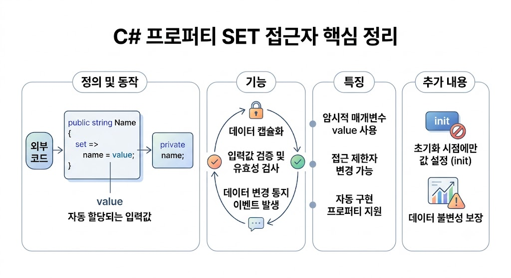

# [Set](../KeywordsList.md)

</img>

| **구분** | **주요 내용** |
| --- | --- |
| **정의** | 프로퍼티에 새 값을 할당할 때 실행되는 데이터 입력용 접근자 메서드 |
| **핵심 키워드** | `value` (외부에서 전달된 값이 자동으로 할당되는 암시적 매개변수) |
| **주요 역할** | 데이터 유효성 검증, 캡슐화 유지, 변경 통지 이벤트 처리 |
| **접근 제어** | `private set` 등을 적용해 외부 변경을 제한 가능 |
| **관련 기능** | 자동 구현 프로퍼티 (`get; set;`), C# 9.0의 불변 접근자 (`init`) |

## 정의

- 프로퍼티(Property)에 새로운 값을 할당할 때 호출되는 메서드 블록
- 객체의 데이터를 외부로부터 받아 필드에 안전하게 저장하거나 검증하는 통로 역할
- 클래스 외부에서 데이터가 전달될 때, 그 값을 수신하여 내부 변수(백킹 필드)에 할당하거나 추가적인 동작을 수행하도록 정의된 구문

```csharp
public class Person
{
    private string name; // 백킹 필드 (Backing Field)

    public string Name // 프로퍼티
    {
        get { return name; }
        set { name = value; } // set 접근자
    }
}
```

## 기능

### 암시적 키워드 `value`

- `set` 접근자 내부에서는 외부에서 전달한 할당값이 `value`라는 암시적 매개변수로 자동 전달됨

```csharp
Person p = new Person();
p.Name = "홍길동"; // "홍길동"이 set 블록의 value 변수에 들어감
```

### 데이터 검증 및 무결성 보장

- 외부에서 유효하지 않은 값이 들어오는 것을 차단하여 객체의 무결성을 유지

```csharp
private int age;

public int Age
{
    get { return age; }
    set
    {
        if (value < 0)
            throw new ArgumentOutOfRangeException("나이는 음수일 수 없습니다.");
        age = value;
    }
}
```

## 특징

- **캡슐화(Encapsulation) 구현 :** 클래스 내부의 필드를 `private`으로 숨기고, `set`을 통해서만 변경을 허용함으로써 안전한 데이터 제어가 가능.
- **접근 제한자 변경 가능 :** `get`과 `set`의 접근 수준을 다르게 설정 가능.

```csharp
public string Id { get; private set; } // 읽기는 외부 공개, 변경은 클래스 내부만 가능
```

- **자동 구현 프로퍼티 지원 :** 검증 로직이 필요 없는 경우, C#이 백킹 필드를 자동으로 만들어 주어 간결하게 작성 가능

```csharp
public int Score { get; set; } // 컴파일러가 익명 백킹 필드를 자동 생성
```

## 알아두면 좋을 내용

### 1. `init` 접근자 (C# 9.0+)

- 객체 생성 시점(초기화 시점)에만 값을 설정하고 이후에는 변경할 수 없도록 강제하는 접근자. 불변(Immutable) 객체를 설계할 때 사용 가능.

```csharp
public class Product
{
    public string Code { get; init; } // 생성자 또는 객체 리터럴 표현식에서만 설정 가능
}

var p = new Product { Code = "P123" }; // 가능
// p.Code = "P456"; // 컴파일 에러 발생!
```

### 2. 변경 통지 이벤트 처리 (INotifyPropertyChanged)

- UI 프레임워크(WPF, MAUI, Unity 등)에서 값이 변경될 때 화면을 자동으로 갱신하도록 이벤트를 발생시키는 용도로 자주 쓰임.

```csharp
private string title;
public string Title
{
    get => title;
    set
    {
        if (title != value)
        {
            title = value;
            OnPropertyChanged(nameof(Title)); // UI에 변경 사실 통보
        }
    }
}
```

### 3. 식 본문(Expression-bodied) 정의

- 로직이 단일 문장일 경우 `=>` 기호를 사용하여 간결하게 작성 가능

```csharp
private string email;
public string Email
{
    get => email;
    set => email = value;
}
```