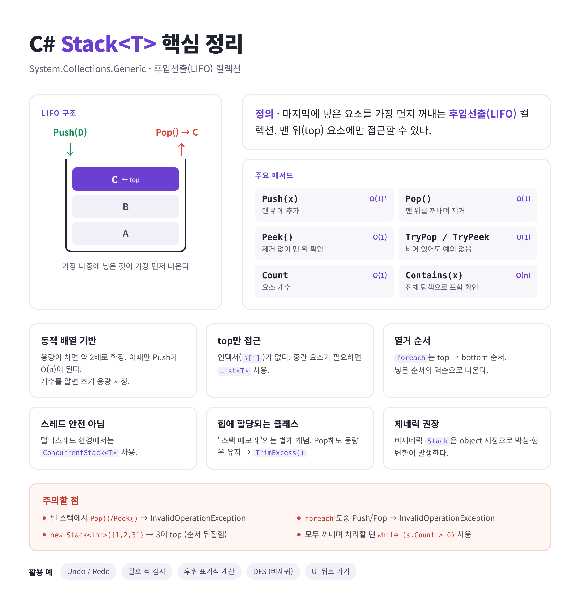

# [Stack](../KeywordsList.md)

</img>

| 항목 | 내용 |
| --- | --- |
| 정의 | 후입선출(LIFO) 방식의 컬렉션 |
| 권장 타입 | `Stack<T>` (`System.Collections.Generic`) |
| 핵심 메서드 | `Push`(추가), `Pop`(꺼내며 제거), `Peek`(제거 없이 확인) |
| 안전한 메서드 | `TryPop`, `TryPeek` (빈 스택에서도 예외 없음) |
| 성능 | Push/Pop/Peek O(1), Contains O(n) |
| 내부 구조 | 동적 배열 (용량이 부족하면 약 2배로 확장) |
| 접근 제한 | 인덱서 없음, top 요소만 접근 가능 |
| 주의할 예외 | 빈 스택에서 Pop/Peek, foreach 중 수정 시 `InvalidOperationException` |
| 열거 순서 | top → bottom (넣은 순서의 역순) |
| 스레드 안전 | 아님, 대신 `ConcurrentStack<T>` 사용 |
| 메모리 | 클래스이므로 힙에 할당되고, Pop 후에도 용량이 유지되므로 `TrimExcess()`로 정리 |
| 주요 활용 | Undo/Redo, 괄호 검사, DFS, 뒤로 가기 |

## 정의

- 후입선출(LIFO, Last In First Out) 방식으로 데이터를 저장하는 컬렉션

```csharp
using System.Collections.Generic;

Stack<int> stack = new Stack<int>();
```

| 종류 | 네임스페이스 | 비고 |
| --- | --- | --- |
| `Stack<T>` (제네릭) | `System.Collections.Generic` | 권장. 타입 안전, 박싱 없음 |
| `Stack` (비제네릭) | `System.Collections` | `object`로 저장. 박싱/언박싱과 형변환이 필요해 레거시 코드에서만 사용 |

## 특징

- **배열 기반 :** 연결 리스트가 아니라 동적 배열로 구현되어 있어, 용량이 차면 기존의 약 2배 크기 배열을 새로 만들어 복사. 그래서 `Push`는 평소 O(1)이지만 확장되는 순간에는 O(n). 넣을 개수를 미리 알면 `new Stack<int>(1000)`처럼 초기 용량을 지정하는 게 좋음
- **맨 위 요소만 접근 :** 인덱서(`stack[i]`)가 없음. 중간 요소에 접근해야 한다면 Stack이 아닌 `List<T>`를 쓰는 게 맞음.
- **빈 스택에서 `Pop()`/`Peek()`를 호출하면 `InvalidOperationException`이 발생 :** `Count`를 먼저 확인하거나 `TryPop`/`TryPeek`를 사용.
- **열거 순서** : top → bottom

```csharp
var s = new Stack<int>();s.Push(1); s.Push(2); s.Push(3);foreach (var x in s) Console.Write(x); // 321
```

- **중복과 `null`을 허용 :** 참조 타입이면 `null`도 넣을 수 있음
- **스레드 :** 여러 스레드에서 동시에 접근하면 `System.Collections.Concurrent.ConcurrentStack<T>`를 사용.

## 기능

| 멤버 | 설명 | 시간 복잡도 |
| --- | --- | --- |
| `Push(T item)` | 맨 위에 요소 추가 | O(1), 용량 확장 시 O(n) |
| `Pop()` | 맨 위 요소를 제거하고 반환 | O(1) |
| `Peek()` | 맨 위 요소를 제거하지 않고 반환 | O(1) |
| `TryPop(out T result)` | 비어 있으면 예외 없이 `false` 반환 | O(1) |
| `TryPeek(out T result)` | 비어 있으면 예외 없이 `false` 반환 | O(1) |
| `Count` | 요소 개수 | O(1) |
| `Contains(T item)` | 포함 여부 확인 (전체 탐색) | O(n) |
| `Clear()` | 모든 요소 제거 | O(n) |
| `ToArray()` | 배열로 복사 (꺼내는 순서대로) | O(n) |
| `TrimExcess()` | 남는 내부 용량 정리 | O(n) |
| `EnsureCapacity(int)` | 최소 용량 확보 (.NET 6+) | O(n) |

```csharp
var stack = new Stack<string>();
stack.Push("A");
stack.Push("B");
stack.Push("C");          // [C, B, A] ← C가 top

Console.WriteLine(stack.Peek()); // C (제거 안 됨)
Console.WriteLine(stack.Pop());  // C (제거됨)
Console.WriteLine(stack.Count);  // 2

if (stack.TryPop(out var top))
    Console.WriteLine(top);      // B
```