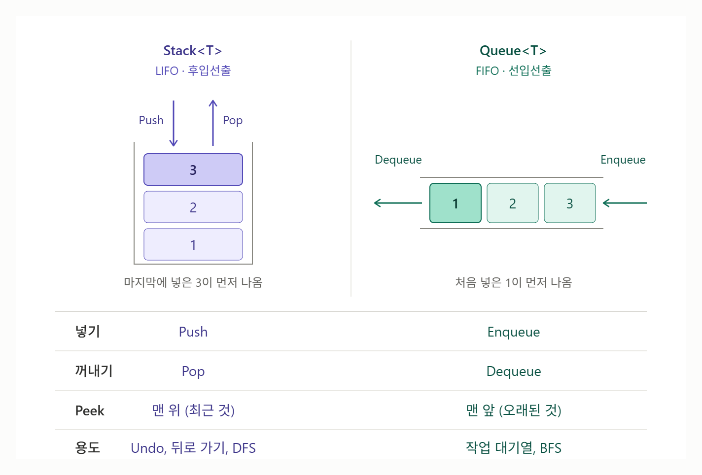

# [Stack vs Queue](../KeywordsList.md)

</img>

| 항목 | Stack<T> | Queue<T> |
| --- | --- | --- |
| 원칙 | LIFO (후입선출) | FIFO (선입선출) |
| 비유 | 쌓인 접시 | 줄 서기 |
| 넣기 | `Push` | `Enqueue` |
| 꺼내기 | `Pop` | `Dequeue` |
| `Peek` 위치 | 맨 위 (최근 것) | 맨 앞 (오래된 것) |
| foreach 순서 | 넣은 역순 | 넣은 순서 |
| 내부 구조 | 배열 (한쪽 끝) | 원형 버퍼 배열 |
| 주요 연산 성능 | O(1) | O(1) |
| 대표 용도 | Undo, 뒤로 가기, DFS | 작업 대기열, 메시지 처리, BFS |
| 스레드 안전 버전 | `ConcurrentStack<T>` | `ConcurrentQueue<T>` |

## 꺼내는 순서

- **Stack** : LIFO(Last In, First Out), 마지막에 넣은 것이 먼저 나옴.
- **Queue :** FIFO(First In, First Out), 먼저 넣은 것이 먼저 나옴.

```csharp
using System.Collections.Generic;

// Stack
Stack<int> stack = new Stack<int>();
stack.Push(1);
stack.Push(2);
stack.Push(3);
Console.WriteLine(stack.Pop());   // 3  ← 마지막에 넣은 것

// Queue
Queue<int> queue = new Queue<int>();
queue.Enqueue(1);
queue.Enqueue(2);
queue.Enqueue(3);
Console.WriteLine(queue.Dequeue()); // 1  ← 처음 넣은 것
```

## 메서드 이름의 차이

| 동작 | Stack | Queue |
| --- | --- | --- |
| 넣기 | `Push(item)` | `Enqueue(item)` |
| 꺼내기(제거) | `Pop()` | `Dequeue()` |
| 꺼내지 않고 확인 | `Peek()` | `Peek()` |
| 안전하게 꺼내기 | `TryPop(out item)` | `TryDequeue(out item)` |
| 안전하게 확인 | `TryPeek(out item)` | `TryPeek(out item)` |
- `Peek()`은 이름은 같지만 보는 위치가 다름. Stack은 맨 위(가장 최근), Queue는 맨 앞(가장 오래된 것)을 봄.
- 비어 있을 때 `Pop()`, `Dequeue()`, `Peek()`을 호출하면 둘 다 `InvalidOperationException`이 발생하므로, `Count`로 확인하거나 `Try...` 메서드를 쓰는 것이 안전.

## 열거 순서의 차이

- `foreach`로 돌리면 각자 꺼내질 순서대로 나옴.

```csharp
// Push 1,2,3 후
foreach (var x in stack) Console.Write(x); // 321

// Enqueue 1,2,3 후
foreach (var x in queue) Console.Write(x); // 123
```

- `ToArray()`도 마찬가지로 Stack은 역순, Queue는 넣은 순서로 배열을 만듦

## 내부 구조와 성능

- 둘 다 내부적으로 배열을 사용하며, 넣기·꺼내기·확인 모두 평균 O(1)(용량이 부족해 배열을 늘릴 때만 O(n)).
- **Stack :** 배열의 끝 한쪽만 사용하므로 구조가 단순.
- **Queue :** 앞에서 빼고 뒤에서 넣어야 하므로 원형 버퍼(circular buffer)로 구현되어 있음. 앞에서 빼도 요소를 당겨 옮기지 않아 O(1)을 유지.

## 언제 무엇을 쓰나

**Stack** : 가장 최근 것부터 되돌아가야 할 때

- 실행 취소(Undo) 기능
- 화면/메뉴 뒤로 가기 (UI 패널 히스토리)
- 괄호 짝 검사, 수식 계산
- DFS(깊이 우선 탐색), 재귀를 반복문으로 바꿀 때

**Queue** : 들어온 순서대로 처리해야 할 때

- 작업/명령 대기열 (예: 게임에서 순서대로 실행되는 행동 명령)
- 대사·알림 메시지를 차례로 출력
- BFS(너비 우선 탐색)
- 오브젝트 풀링(사용 후 반납한 오브젝트를 순서대로 재사용)