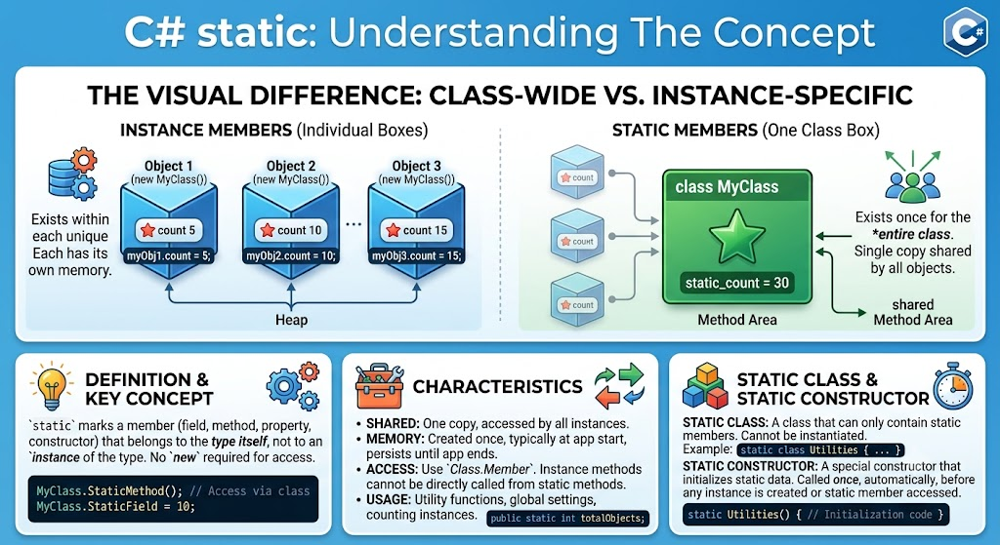

# [Static](../KeywordsList.md)

</img>

| **구분** | **static 멤버 / 클래스** | **인스턴스 (일반) 멤버 / 클래스** |
| --- | --- | --- |
| **메모리 할당 시점** | 프로그램 로드 / 클래스 최초 접근 시 | `new` 키워드로 객체 생성 시 |
| **접근 방식** | `클래스명.멤버명` | `객체명.멤버명` |
| **공유 여부** | 모든 객체가 하나의 값/메모리를 공유 | 객체마다 독립적인 메모리 공간 소유 |
| **`this` 사용** | 불가능 | 가능 |
| **주요 용도** | 유틸리티 함수, 공통 상수, 단일 상태 관리 | 객체 고유의 속성 및 상태 관리 |

## 정의

- 메서드, 필드, 프로퍼티, 생성자, 그리고 클래스 자체에 지정할 수 있는 수식어
- 특정 객체에 종속되는 것이 아니라, 프로그램 실행 시 메모리의 static 영역(메서드 영역)에 단 하나만 할당되어 모든 객체가 공유

## 기능

- **공유 데이터 관리 (static 필드/프로퍼티)**
    - 개별 객체가 아닌, 클래스 전체에서 공유해야 하는 데이터나 상태를 다룰 때 사용. (예: 생성된 객체의 총 개수 세기, 공통 설정값 저장)
- **유틸리티 기능 제공 (static 메서드)**
    - 객체의 상태(인스턴스 변수)에 의존하지 않고, 입력값만 받아서 결과를 반환하는 pure한 기능 함수를 만들 때 사용. (예: `Math.Abs()`, `Convert.ToInt32()`)
- **객체 생성 없이 바로 호출**
    - 메모리 할당(`new`) 절차 없이 `클래스명.멤버명` 형태로 즉시 호출할 수 있어 편리함.

## 특징

- **메모리 수명주기 (Lifetime)**
    - 프로그램이 시작될 때 메모리에 로드되고, 프로그램이 종료될 때 메모리에서 해제됨.
- **접근 규칙**
    - `static` 메서드 내부에서는 **`static`** 멤버만 접근 가능. (인스턴스 멤버는 객체가 생성되어야만 존재하므로, `static` 영역에서 직접 접근할 수 없습니다.)
    - 반대로, 일반 인스턴스 메서드 내부에서는 `static` 멤버에 자유롭게 접근 가능.
- **`this` 키워드 사용 불가**
    - `this`는 현재 접근 중인 "특정 객체 인스턴스"를 가리키므로, 객체 없이 작동하는 `static` 메서드 내부에서는 사용 불가.

## 알아두면 좋을 내용

#### static 생성자 (Static Constructor)

- 클래스가 처음으로 사용될 때(static 멤버에 접근하거나 인스턴스를 생성할 때) 단 한 번만 자동으로 실행되는 생성자.
- 접근 제한자(`public`, `private` 등)나 매개변수를 가질 수 없으며, 개발자가 직접 호출할 수 없음.
- 주로 `static` 필드를 초기화하거나, 단 한 번만 수행해야 하는 사전 작업을 처리할 때 사용.

#### static 클래스 (Static Class)

- `static class`로 선언하면 인스턴스 생성(`new`)이 엄격히 금지되며, 내부의 모든 멤버도 반드시 `static`이어야 함.
- 상속(`sealed` 상태) 및 인터페이스 구현이 불가능.
- C#의 `System.Math`나 `System.Console`이 대표적인 static 클래스.