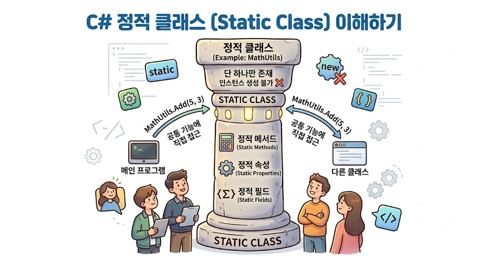

# [Static Class](../KeywordsList.md)

</img>

| **구분** | **주요 내용** |
| --- | --- |
| **인스턴스 생성** | 불가 (`new` 키워드 사용 금지) |
| **멤버 구성** | 모든 멤버가 `static`이어야 함 |
| **상속 / 인터페이스** | 상속 불가 (자동 `sealed`), 인터페이스 구현 불가 |
| **생성자** | 정적 생성자만 가능 (매개변수 없음, CLR이 자동 호출) |
| **주요 용도** | 유틸리티 함수 모음 (`Math` 등), 확장 메서드 정의, 전역 상수 관리 |
| **주의 사항** | 상태 관리 시 쓰레드 안전성 문제 주의, 단위 테스트 시 Mocking 어려움 |

## 정의

- 인스턴스(객체)를 생성하지 않고, 클래스 이름 자체를 통해 멤버에 직접 접근하여 사용하는 특수한 형태의 클래스
- 메모리에 단 한 번만 로드되어 프로그램이 종료될 때까지 유지되는 클래스
- 상태를 유지할 필요가 없거나, 공통으로 자주 사용되는 유틸리티 함수들을 모아둘 때 주로 사용

## 기능

- **유틸리티 및 도구 모음 :** 수학 계산 함수(`System.Math`), 문자열 처리, 파일 I/O 등 상태값이 필요 없고 입력값에 따른 결과만 반환하는 함수들을 묶어 관리.
- **확장 메서드(Extension Methods) 제공자 :** 기존 타입을 수정하지 않고 새로운 메서드를 추가할 때 사용하는 C#의 확장 메서드는 반드시 비제네릭 `static` 클래스 내에 정의해야 함.
- **전역 접근점 제공 :** 프로그램 전체에서 공유해야 하는 공통 데이터나 상수, 편의 기능에 쉽게 접근할 수 있게 함.

## 특징

- **인스턴스화 불가 (`new` 키워드 사용 금지)**
    - `MathUtils utils = new MathUtils();`와 같이 객체를 생성할 수 없으며, 시도 시 컴파일 에러가 발생.
- **모든 멤버의 정적화 (`static`)**
    - 클래스 내부의 모든 필드, 속성, 메서드, 이벤트 등은 반드시 `static` 키워드를 가져야 함.
- **상속 불가 (`sealed` 특성)**
    - `static` 클래스는 다른 클래스를 상속할 수 없으며(단, `System.Object`는 제외), 다른 클래스가 `static` 클래스를 상속받는 것도 불가능. (개념적으로 자동 `sealed` 처리됨)
- **인터페이스 구현 불가**
    - 인터페이스의 메서드는 인스턴스를 통해 호출되는 것을 전제로 하므로 `static` 클래스는 인터페이스를 구현할 수 없습니다.
- **정적 생성자(Static Constructor)만 지원**
    - 매개변수를 받는 일반 생성자는 사용할 수 없으며, 매개변수가 없고 접근 제한자(`public`, `private` 등)를 붙이지 않는 정적 생성자만 가질 수 있음.

## 알아두면 좋을 내용

**정적 생성자 (Static Constructor)**

- `static` 클래스의 초기화 작업(예: 정적 필드 값 설정 등)이 필요할 때 사용.
- 개발자가 직접 호출할 수 없으며, 해당 클래스가 메모리에 처음 참조될 때 CLR에 의해 단 한 번만 자동으로 실행.
- **장점:** `new`를 통한 객체 생성 과정이 없어 메모리 할당 및 가비지 컬렉션(GC) 부담이 줄어들며, 호출이 직관적.
- **주의점 (객체지향 원칙 관점):**
    - **상태 유지 금지:** `static` 클래스 내에 가변 상태(변경 가능한 필드)를 둘 경우, 다중 쓰레드 환경에서 동시성 문제(Race Condition)가 발생할 수 있음. 가능한 한 읽기 전용 데이터만 다루는 것이 좋다.
    - **테스트 용이성 저하:** 인터페이스를 구현할 수 없고 객체 생성이 안 되기 때문에, 단위 테스트(Unit Test) 시 모의 객체(Mocking)로 교체하기가 어려움. 따라서 의존성 주입(DI)이 필요한 핵심 비즈니스 로직에는 적합하지 않다.