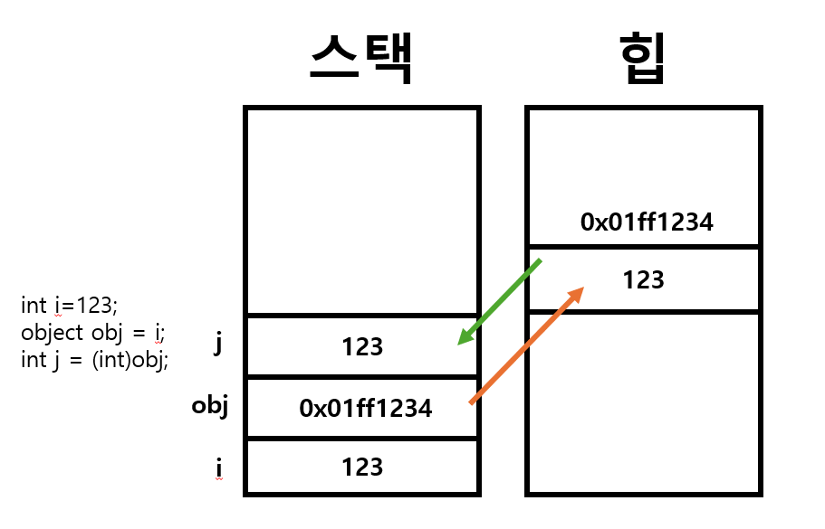

# [Unboxing](../KeywordsList.md)

</img>

| **구분** | **주요 내용** |
| --- | --- |
| **정의** | 힙(Heap) 영역에 박싱되어 있던 참조 타입(`object`) 데이터를 다시 스택(Stack) 영역의 값 타입 데이터로 추출/복사하는 과정 |
| **변환 방식** | 명시적 형변환 필수 (예: `(int)obj`) |
| **메모리 동작** | 힙 메모리의 값을 스택 메모리로 복사 |
| **주의사항** |   1. 박싱 이전의 원래 타입과 정확히 일치해야 함 (불일치 시 `InvalidCastException`)<br>2. `null` 객체를 언박싱 시 `NullReferenceException` 발생<br>3. 반복적인 연산 시 성능 저하 및 GC 부하 발생 $\rightarrow$ 제네릭(Generics) 사용 권장 |

## 정의

- 힙(Heap) 영역에 객체 형태로 저장되어 있던 값 타입 데이터를 다시 스택(Stack) 영역의 값 타입 데이터로 복사해 오는 명시적 변환 과정
    - **박싱 (Boxing) :** 값 타입(스택) $\rightarrow$ 참조 타입(힙) [암시적 변환 가능]
    - **언박싱 (Unboxing) :** 참조 타입(힙) $\rightarrow$ 값 타입(스택) [명시적 형변환 필요]

```csharp
int originalNum = 123;
object boxedNum = originalNum; // 박싱 (힙 메모리에 123 생성)

int unboxedNum = (int)boxedNum; // 언박싱 (힙의 123을 스택으로 복사)
```

## 특징

- **명시적 캐스팅(Explicit Casting) 필수 :** 박싱과 달리 언박싱은 개발자가 괄호 `(Type)`를 사용하여 변환할 값 타입을 명시해야 함.
- **값의 복사 (Copying) :** 힙에 있는 객체 안의 값을 가져와 스택의 새로운 값 타입 변수에 복사. 따라서 언박싱한 변수의 값을 변경해도 힙에 있는 박싱된 객체의 값은 변경되지 않는다.
- **2단계 내부 동작 :** 언박싱이 일어날 때 CLR(공통 언어 런타임)은 내부적으로 다음 두 과정을 거침.
    1. `object` 참조가 지정한 값 타입의 박싱된 값인지 확인.
    2. 확인이 완료되면 힙에서 스택으로 값을 복사.

## 주의 사항

1. **정확한 타입 일치 필수 (`InvalidCastException`)** : 언박싱을 할 때는 박싱되기 전의 원본 타입과 정확히 일치하는 타입으로만 캐스팅할 수 있다. 호환되는 타입이라 할지라도 다른 타입으로 바로 언박싱하면 런타임에 `InvalidCastException` 에러가 발생함.

```csharp
int num = 100;
object boxed = num; // int 타입으로 박싱됨

// 잘못된 예시: int로 박싱된 것을 double로 바로 언박싱 불가
double doubleNum = (double)boxed; // InvalidCastException 발생!

// 올바른 예시: 원래 타입(int)으로 언박싱 후 double로 변환
double doubleNum = (double)(int)boxed;
```

1. **NullReferenceException 위험** : 박싱된 `object` 변수가 `null` 값을 가지고 있는 상태에서 언박싱을 시도하면 `NullReferenceException`이 발생함.

```csharp
object boxed = null;
int num = (int)boxed; // NullReferenceException 발생!
```

1. **성능 저하 (Performance Overhead) :** 
    - **CPU 비용 :** 힙 메모리의 주소를 참조하고, 타입을 검증하며, 값을 스택으로 복사하는 연산 과정이 수반됨.
    - **가비지 컬렉터(GC) 부하 :** 언박싱 자체보다는 박싱/언박싱이 빈번하게 일어날 때 힙 메모리에 수많은 객체가 생성/해제되면서 GC(Garbage Collector)의 부하를 유발.
    - **해결책 (제네릭 활용):** Generics(예: `List<T>`)을 사용하면 박싱과 언박싱 없이 타입 안정성을 유지하면서 데이터를 처리할 수 있음.