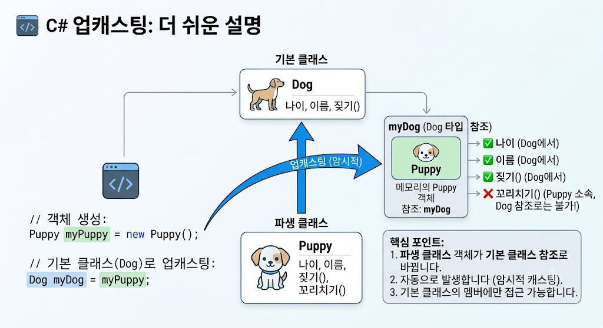

# [Upcasting](../KeywordsListm.md)

</img>

| **구분** | **내용** |
| --- | --- |
| **방향** | 자식 클래스 타입 $\rightarrow$ 부모 클래스 타입 |
| **형변환 방식** | 암시적(Implicit) 자동 변환 |
| **안전성** | 매우 안전함 (예외 발생 없음) |
| **멤버 접근** | 부모 클래스 멤버만 접근 가능 (자식 고유 멤버 숨김) |
| **주요 목적** | 다형성(Polymorphism) 활용 및 공통 인터페이스 관리 |

## 정의

- 상속 관계에 있는 자식 클래스의 참조를 부모 클래스(또는 구현된 인터페이스) 타입의 참조로 변환하는 과정
- 상속 계층 구조에서 파생 클래스(Derived Class)의 인스턴스를 기본 클래스(Base Class) 타입의 변수에 할당하는 행위
- 객체의 실제 메모리 형태는 자식 클래스이지만, 변수를 다루는 관점은 부모 클래스로 제한

## 기능

- **다형성 구현 :** 부모 타입 하나로 다양한 자식 객체들을 일괄적으로 처리할 수 있는 기반을 제공.
- **유연한 매개변수 및 컬렉션 관리 :** `List<Animal>`과 같은 부모 타입 컬렉션에 `Dog`, `Cat` 등 서로 다른 자식 객체들을 함께 담아 관리할 수 있음.

## 특징

- **암시적 변환(Implicit Conversion) :** 자식 클래스는 부모 클래스의 모든 멤버를 포함하고 있어 데이터 손실 위험이 없으므로, 명시적인 캐스팅 연산자(`(Parent)`)를 생략할 수 있음.
- **타입 안정성 :** 컴파일 타임과 런타임 모두에 안전하며 `InvalidCastException`과 같은 캐스팅 예외가 발생하지 않음.
- **접근 범위 제한 :** 업캐스팅된 변수를 통해서는 부모 클래스에 정의된 멤버와 메서드에만 접근할 수 있으며, 자식 클래스에만 존재하는 고유 멤버는 숨겨짐.

## 알아두면 좋을 내용

- **가상 메서드(Virtual Methods)와 동적 바인딩 :** 업캐스팅된 상태에서 메서드를 호출하더라도, 해당 메서드가 자식 클래스에서 `override` 되었다면 런타임 시점에 실제 객체의 타입(자식)에 정의된 메서드가 실행됨.
- **다운캐스팅(Downcasting)과의 관계 :** 업캐스팅된 객체를 다시 원래의 자식 타입으로 되돌리는 것을 다운캐스팅. 다운캐스팅은 명시적 형변환이 필요하며, 안전한 변환을 위해 `is`나 `as` 연산자를 함께 사용하는 것이 좋다.