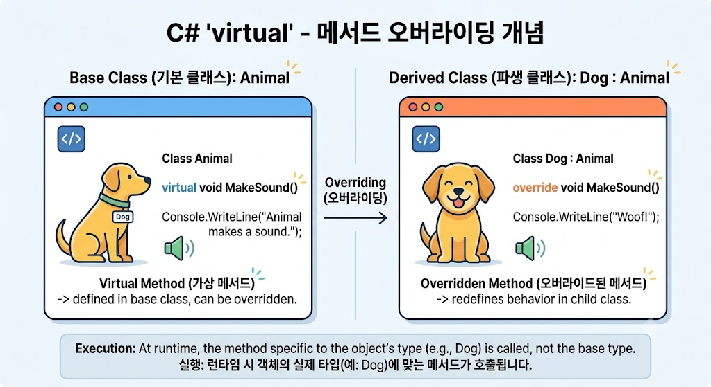

# [Virtual](../KeywordsList.md)

</img>

| **구분** | **설명** |
| --- | --- |
| **정의** | 자식 클래스에서 재정의(`override`)할 수 있도록 허용하는 부모 클래스의 멤버 한정자 |
| **기능** | 런타임 시점에 실제 객체 타입을 확인하여 적절한 메서드를 실행하는 다형성 구현 |
| **특징** | • 반드시 기본 구현부(본문)가 존재해야 함 • 자식 클래스에서 필수가 아닌 선택적 오버라이딩 가능 • 필드(변수)에는 사용 불가 |
| **연관 키워드** | `override` (재정의), `sealed` (오버라이딩 차단), `new` (메서드 숨기기) |

## 정의

- 객체지향 프로그래밍의 핵심 요소인 다형성(Polymorphism)을 구현하기 위해 사용되는 매우 중요한 기능
- 부모 클래스(Base Class)의 메서드, 프로퍼티, 인덱서, 또는 이벤트에 선언하는 한정자(Modifier)
- 자식 클래스(Derived Class)가 부모 클래스의 멤버를 오버라이딩(Overriding, 재정의)할 수 있도록 허용하는 역할

## 기능

- **동적 바인딩(Dynamic Binding / 런타임 다형성) :** 컴파일 시점이 아니라, 프로그램이 실행되는 런타임(Runtime) 시점에 실제 객체의 타입(인스턴스)을 확인하고, 그에 맞는 메서드를 호출.
- **코드 재사용성 및 확장성 향상 :** 공통된 인터페이스나 부모 클래스를 유지하면서, 각 자식 클래스 특성에 맞는 구체적인 동작을 구현 가능.

## 특징

- **`override`와의 쌍방 관계 :** `virtual`로 지정된 부모 클래스의 멤버는 자식 클래스에서 `override` 키워드를 사용해 재정의할 수 있음.
- **기본 구현 제공 :** `abstract`(추상) 멤버와는 달리, `virtual` 멤버는 부모 클래스에 기본 구현부(Body)를 반드시 가져야 함. 자식 클래스가 오버라이딩을 하지 않으면 부모 클래스에 정의된 기본 동작이 그대로 실행됨.
- **필드(Field)에는 사용 불가 :** 메서드, 프로퍼티, 인덱서, 이벤트에만 적용할 수 있으며 변수(필드)에는 사용할 수 없음.

## 알아두면 좋을 내용

- **`new` 키워드와의 차이점 (`hiding` vs `overriding`) :**
자식 클래스에서 부모의 `virtual` 메서드를 오버라이딩할 때 `override` 대신 `new`를 쓰면 메서드 숨기기(Method Hiding)가 일어남. `new`는 다형성을 유지하지 못하고, 참조하는 변수의 타입(부모 또는 자식)에 따라 호출되는 메서드가 달라지므로 주의해야 함.
- **`sealed override`:**
자식 클래스가 `virtual` 메서드를 `override`한 뒤, 그 손자 클래스에서는 더 이상 오버라이딩하지 못하도록 막고 싶을 때 `sealed override`를 사용 가능.
- **성능(Performance) 고려사항 :**`virtual` 메서드는 런타임에 vtable(가상 메서드 테이블)을 참조하는 과정을 거치기 때문에, 일반 메서드 호출에 비해 아주 미세한 성능 부하가 발생할 수 있음(하지만 대부분의 애플리케이션에서는 무시할 수 있는 수준)