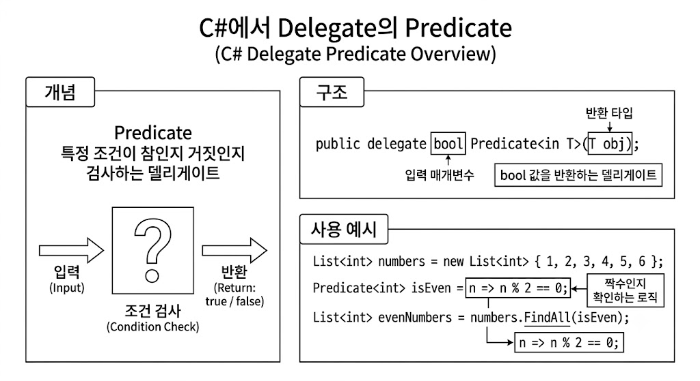

# [delegate - predicate](../KeywordsList.md)

</img>

| **구분** | **내용** |
| --- | --- |
| **정의** | 조건을 평가하여 `bool` 값을 반환하는 제네릭 델리게이트 (`System.Predicate<T>`) |
| **시그니처** | `bool Predicate<in T>(T obj)` |
| **주요 기능** | 컬렉션 내 데이터 검색, 필터링, 조건 검증 |
| **주요 사용처** | `List<T>.Find()`, `List<T>.Exists()`, `Array.FindAll()` 등 |
| **비교 대안** | `Func<T, bool>` (기능은 동일하며, 현대 C# 및 LINQ에서 더 널리 쓰임) |

## 정의

- 단일 입력 인수를 받아 조건을 검사한 후 참(`true`) 또는 거짓(`false`)을 반환하는 제네릭 델리게이트
- 컬렉션 내에서 특정 조건을 만족하는 데이터를 검색하거나 필터링할 때 사용
    
    ```csharp
    public delegate bool Predicate<in T>(T obj);
    ```
    
    - **입력 (`T obj`) :** 검사할 대상 객체 1개 (`in` 키워드가 적용되어 반공변성을 가짐)
    - **출력 (`bool`) :** 조건 충족 여부 (참 또는 거짓)

## 기능

- **조건 검사 :** 전달된 객체가 특정 기준을 충족하는지 여부를 판별.
- **컬렉션 메서드 연계 :** `List<T>`나 배열 클래스의 내장 메서드와 결합하여 데이터 탐색 및 조작을 수행. 대표적으로 `Find`, `FindAll`, `Exists`, `RemoveAll`, `TrueForAll` 등.

## 특징

- **간결한 문법 :** 람다 표현식이나 무명 메서드를 인수로 직접 받을 수 있어 코드가 직관적입니다.
- **타입 안정성 :** 제네릭 기반이므로 잘못된 타입의 데이터가 들어오는 것을 컴파일 타임에 방지

## 알아두면 좋을 내용

- `Predicate<T>` 대신 `Func<T, bool>`을 더 자주 사용하는 추세