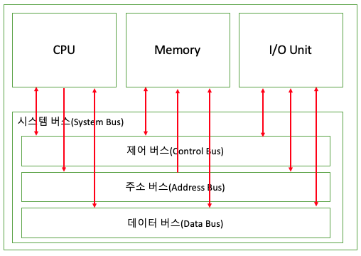

# [시스템 버스](../KeywordsList.md)

</img>

| **구분** | **주소 버스 (Address Bus)** | **데이터 버스 (Data Bus)** | **제어 버스 (Control Bus)** |
| --- | --- | --- | --- |
| **전송 정보** | 메모리/IO 장치 주소 | 명령어, 계산 데이터 등 | 읽기/쓰기 제어, 인터럽트, 클록 |
| **통신 방향** | 단방향 (CPU $\rightarrow$ 다른 장치) | 양방향 (CPU $\leftrightarrow$ 다른 장치) | 양방향 (신호에 따라 다름) |
| **성능 영향** | 최대 메모리 주소 지정 범위 결정 | CPU 일시 처리 데이터 단위 및 대역폭 결정 | 시스템 동기화 및 제어 제어성 결정 |
| **주요 역할** | "어디로 갈 것인가" (Where) | "무엇을 보낼 것인가" (What) | "언제/어떻게 할 것인가" (How) |

## 정의

- CPU, 메모리, 입출력장치 등 컴퓨터 내부의 주요 하드웨어 구성 요소들이 서로 데이터를 주고받을 수 있도록 연결하는 공통의 통로(전기적 신호선)

## 기능

- **데이터 버스 (Data Bus)**
    - **기능 :** CPU와 메모리, 입출력장치 사이에 실제 데이터나 명령어(Opcode)를 실어 나름.
    - **특징 :** 데이터를 읽고 쓰는 작업이 모두 필요하므로 양방향(Bidirectional) 통신을 함. 데이터 버스의 폭(비트 수)은 CPU가 한 번에 처리할 수 있는 데이터의 크기(예: 32bit, 64bit)를 결정.
- **주소 버스 (Address Bus)**
    - **기능 :** CPU가 데이터를 읽거나 쓸 메모리 번지(주소)나 입출력장치(I/O Port)의 주소 지정 신호를 보냄.
    - **특징 :** 주소는 항상 CPU가 지정하여 타깃 장치로 전달하므로 단방향(Unidirectional) 통신을 합니다. 주소 버스의 폭은 시스템이 접근할 수 있는 최대 메모리 용량($2^{주소\,선\,수}$)을 결정.
- **제어 버스 (Control Bus)**
    - **기능 :** 시스템 구성 요소들의 동작을 제어하기 위해 읽기/쓰기 신호, 인터럽트(Interrupt), 시계(Clock) 신호 등을 전달.
    - **특징 :** 각 제어 신호마다 전달 방향이 다르므로 양방향 통신 성격을 띔.

## 특징

- **공유 통로 (Shared Medium) :** 모든 장치가 하나의 버스 라인을 공유하므로, 특정 시점에는 오직 하나의 장치만 데이터를 전송할 수 있음.
- **충돌 방지 (Bus Arbitration) :** 복수의 장치가 동시에 버스를 사용하려 할 때 병목현상이나 신호 충돌을 막기 위해 '버스 중재(Bus Arbitration)' 메커니즘이 필수적.
- **클록 동기화 :** 버스 클록(Bus Clock) 속도에 맞춰 신호가 동기화되어 전달되며, 이 속도가 전체 시스템의 성능(대역폭)을 좌우함.

## 상호작용

- **주소 출력 :** CPU가 읽고자 하는 메모리 주소를 주소 버스에 실어 보냄.
- **제어 신호 전송 :** CPU가 제어 버스를 통해 `메모리 읽기(Memory Read)` 신호를 메모리 컨트롤러에 보냄.
- **메모리 탐색 :** 메모리는 주소 버스에서 주소를 확인하고 해당 위치의 데이터를 찾음.
- **데이터 전달 :** 메모리가 해당 위치의 데이터를 데이터 버스에 실어 보내면, CPU가 이를 읽어 레지스터에 저장.