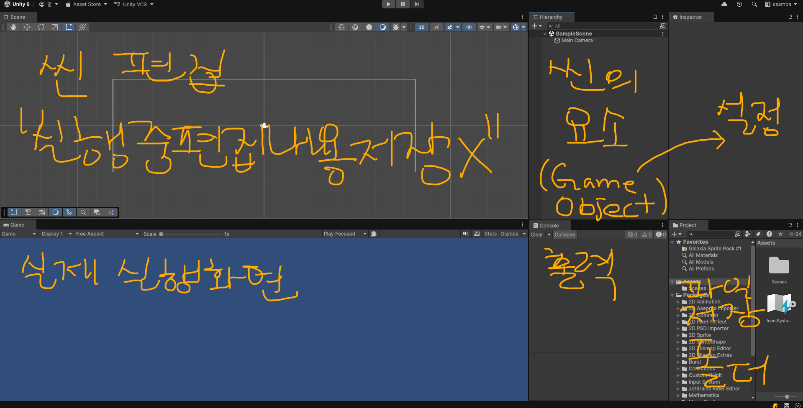
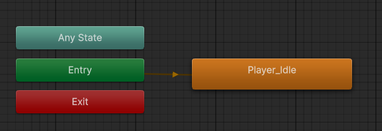
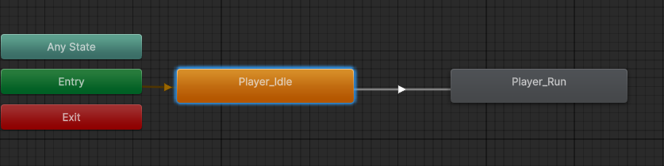

# U01_Start

</img>

- R(ed) G(reen) B(lue) A(투명도)

| X축 | Y축  | Z축 |  |
| --- | --- | --- | --- |
| R(ed) | G(reen) | B(lue) |  |
| 0 | 0 | 0 | 검은색 |
| 1 | 1 | 1 | 흰색 |
| 1 | 0 | 0 | 빨간색 |
| 0 | 1 | 0 | 초록색 |
- RGB색상 순서대로 X,Y,Z축이 표시되어 있음.
- 2D라면 X, Y만 있으니 R과 G 화살표만 보임!

### [Scene Layer]

- Move tool (단축키: w)
- Rotation tool - z축 (단축키: e)
    - 시계 방향: (-), 반시계 방향: (+)
- Scale tool : 원본 비율이 1에 곱하기 (단축키: r)

### [Project Layer]

- 스크립트 생성 시 MonoBehaviour script 라고 기본으로 나오는 이유: MonoBehaviour 클래스로부터 상속을 받기 때문에 기본 이름이 이렇게 되어 있음

```csharp
public class Example : MonoBehaviour //MonoBehaviour 클래스 상속
```

- 스크립트 파일 이름이랑 클래스 이름이 **반드시** 같아야 함!(안 그럼 에러남)

### [Inspector]

- 게임 오브젝트의 설정창
- 게임 오브젝트의 필요한 기능을 component로 추가해서 사용

### private void Start()

- 유니티는 게임이 시작 되면 Start() 함수가 먼저 실행됨

```csharp
    private void Start() //게임 시작할 때
    {
        print("Hello, Unity!");
    }
```

⇒ 게임 플레이 시 콘솔창에 Hello, Unity! 나옴

### private void Update()

```csharp
private void Update() //매 프레임마다 실행되는 함수
    {
        //count++; //호출될때마다 count 1씩 증가

        //print($"Count : {count}");

        if (Input.GetKeyDown(KeyCode.RightArrow))
        {
            transform.Translate(1, 0, 0);
        }
    }
```

- 매 프레임마다 호출되는 함수
- 컴퓨터 사양에 따라 호출되는 횟수가 다름. 사양 차이를 방지하기 위해 함수 호출 횟수에 함수가 호출되는 사이의 시간 간격(delta time:$\Delta$ )을 곱해줌.

```
좋은 컴 : 0 0 0 0 0 0 0 0 0 0 => 10번 x 1초 = 10
안좋은컴: 0  0  0  0  0 => 5번 x 2초 = 10
```

[좌우 방향키를 누르면 각각 좌우 방향으로 네모가 이동하는 스크립트]

```csharp
using UnityEngine;

public class Example : MonoBehaviour
{
    [SerializeField] //Attribute : private 변수를 에디터에서 편집하고 싶을때 사용
    [Range(1,10)]//speed의 범위를 1에서 10까지로 제한
    private float speed = 2.0f;//멤버변수를 public으로 열면  에디터에 등장함

    private void Start() //게임 시작
    {
        print("Hello, Unity!");
    }

    //private int count;

    private void Update()//매 프레임 실행
    {
        //count++;

        //print($"Count : {count}");

        if (Input.GetKey(KeyCode.RightArrow)) 
        {
        //
            transform.Translate(speed * Time.deltaTime, 0, 0);
            //클래스 내의 이름으로 바로 접근하는 변수: static 변수 
            //(+) (-)는 방향, 값은 **속도**를 의미
        }
        else if (Input.GetKey(KeyCode.LeftArrow))
        {
            transform.Translate(-speed * Time.deltaTime, 0, 0);
        }
    }
}

```

- GetKeyDown: 눌렀을 때 한번, GetKey:누르고 있을 때 쭉

### [Animator]

- 애니메이션 클립 : 한 동작의 애니메이션
- idle 아무것도 안하는 기본 상태
- 애니메이터 컨트롤러를 생성해서 더블 클릭하면 아래 화면.

</img>

- 플레이하면 화면의 Player가 Player Idle 애니메이션 클립을 수행한다.
- 알트+좌클릭으로 움직일 수 있다

</img>

- 트랜지션(전이)로 애니메이션 클립끼리 이동
- 스페이스바가 눌리면 애니메이터의 Run 조건을 true로 변경하는 스크립트

```csharp
using UnityEngine;

public class Player : MonoBehaviour
{
    private Animator animator; 

    private void Start()
    {
        animator = GetComponent<Animator>();//객체의 애니메이터 객체를 가져옴
    }

    private void Update()
    {
        if (Input.GetKeyDown(KeyCode.Space))//스페이스바가 입력되면
        {
            animator.SetBool("Run", true);//애니메이터의 Run 조건을 true로 변경
        }
    }
}//Run이 true로 변경되면 Idle 애니메이션이 Run 애니메이션 클립으로 넘어가겠지
```