# [U02_Running](../UnityStudy_List.md)

약간 2D Infinite Running 게임 느낌

### [CONSOLE]

- Collapse : 같은 종류의 메세지는 묶어서 보여줌
- c#꿀팁 : 영역 선택 후 컨트롤+h : 찾아 바꾸기 가능.

### [Sprite Renderer]

- sprite renderer : 게임 오브젝트의 이미지를 나타내는 컴포넌트
    - Sprite를 렌더링하고 스프라이트가 씬에 시각적으로 표시되는 방식을 제어
    - order in layer : 크기가 클수록 앞으로 나옴

### [물리엔진]

- Box2D : 기본 2D 물리 시스템(Rigidbody 2D, BoxCollider2D 등).
- 충돌 감지, 중력, 힘 적용 등 기본적인 2D 상호작용은 모두 이 엔진을 기반으로 작동

### [애니메이터]

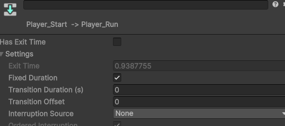</img>

- 하늘에서 떨어지고 나서 점프 모션이 끝나면 뛰는게 아니고 땅에 닿자마자 뛰는 거니까 has exit time은 해제
- 전환하는데 지연시간이 있으면 안되니까 transition duration은 0

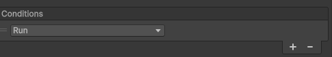</img>

- 전이 조건 : Run이 호출되면 애니메이션 전환

```csharp
private void OnCollisionEnter2D(Collision2D collision)//플레이어가 땅에 닿는 순간 호출(충돌)
{//함수호출 : 플레이어 | 파라미터 : 블록

//게임 시작 상태가 아닐때만 게임을 시작하고 점프 동작을 달리는 동작으로 바꿔줌
    if(game.GameStart == false)
    {
        game.StartGame();//

        animator.SetTrigger("Run");//애니메이터의 트리거를 Run으로 설정
    }
}//그러면 땅에 닿자 마자 Run 애니메이션으로 달림
```

game.StartGame() 왜하는 건지 질문 그냥 땅에 닿으면 애니메이션만 바꾸면 되는거 아닌가? 왜 스타트게임을 따로 또 하는거지? 애니메이터에 스타트 상태라서 그런건가?

⇒배경 이미지 움직임이라든지 블록 움직이라든지 게임과 관련된 사항을 bool bGameStart변수로 여기저기 가져와서 관리를 하기 위함

### [점프 기능 추가]

```jsx
[Player]
private new Rigidbody2D rigidbody2D;
//부모클래스에 rigidbody2D가 이미 있어서 숨김처리됨. 
//new키워드를 사용해서 부모 클래스의 변수명은 무시하고 그냥 이걸로 쓸거라고 선언.

private void Awake()//앱이 시작할 때 호출(Start보다 먼저 실행)
{
    rigidbody2D = GetComponent<Rigidbody2D>(); //Player의 Rigidbody2D를 가져옴
}

private void Update()
{
    if (Input.GetKeyDown(KeyCode.Space)) //스페이스바가 입력되면
    {
        rigidbody2D.linearVelocityY = 10.0f; //y축 이동속도 10.0f로 설정
    }
}
```

- 스페이스바를 누르면 Player가 y방향으로 10.0f속도로 위로 올라갔다 내려옴
- Rigidbody2D.linearVelocityY : 2D 강체의 Y축(수직) 이동 속도를 읽거나 설정할 때 사용하는 속성

⇒대신 누를 때마다 계속 쩜푸함… 바닥에 닿았을 때만 점프하도록 수정 필요

- 땅에 닿았을 때를 저장하는 변수 : `private bool bLanded;`

```csharp
private void Update()
{
    if (Input.GetKeyDown(KeyCode.Space) == false)
        return;

    if (bLanded == false)
        return;
    //여기까지 return이 안되면 스페이스바도 눌리고 땅에도 닿아있는 상태
    bLanded = false; //점프하니까 false로 바꿔주고
    
    animator.SetBool("Jump", true);//동작도 점프 동작으로 바꿔줌

    rigidbody2D.linearVelocityY = 10.0f; //Jump
}

private void OnCollisionEnter2D(Collision2D collision)//플레이어가 땅에 닿으면 호출(충돌)
{//함수호출 : 플레이어 | 파라미터 : 블록
    
    if(game.GameStart == false)//게임 시작 상태가 아닐때만 게임을 시작하고 점프 동작을 달리는 동작으로 바꿔줌
    {
        game.StartGame();

        animator.SetTrigger("Run");
    }

    bLanded = true;
    animator.SetBool("Jump", false);//땅에 닿아있는 상태니까 애니메이터의 jump는 false

    
}
```

⇒ 이렇게 되면 플레이어는 무조건 땅에 닿았을 때 한번 점프 가능!

⇒근데 나는 2번 점프 하고 싶어

- 2단점프 기능 jumpCount변수를 생성해서 조건문 걸어줌 : `private int jumpCount;`

```csharp
private void Update()
{
    if (Input.GetKeyDown(KeyCode.Space) == false)
        return;

    if (bLanded || jumpCount < 2)//땅을 밟고 있거나 점프를 2번 미만으로 뛴 경우
    {
        bLanded = false; //점프했으니까 false로 바꿔주고
        jumpCount++;//점프 횟수 증가
        animator.SetBool("Jump", true);//동작도 점프 동작으로 바꿔줌

        rigidbody2D.linearVelocityY = 10.0f; //Jump
    }
}

private void OnCollisionEnter2D(Collision2D collision)
{
		```
    bLanded = true;
    jumpCount = 0;//땅에 닿는 순간은 무조건 카운트가 0이됨
    animator.SetBool("Jump", false);
		```
}
```

⇒ 이렇게 하면 2단 점프 가능!

⇒ 근데 나는 최대 점프 횟수를 에디터에서 좀 조절하고 싶어

```csharp
[SerializeField, Range(1,4)]
private int maxJumpCount = 2; //기본값은 2로 설정하고 에디터에서 1~4까지 설정할수 있게 SerializeField로 지정
 
private void Update()
{
    if (Input.GetKeyDown(KeyCode.Space) == false)
        return;

    if (bLanded || jumpCount < maxJumpCount)//땅을 밟거나 점프 횟수가 최대 점프 횟수보다 작을 경우
    {
        bLanded = false; 
        jumpCount++;
        animator.SetBool("Jump", true);

        rigidbody2D.linearVelocityY = 10.0f; //Jump
    }
}
```

⇒이렇게 하면 기본은 2단 점프지만 에디터에서 설정한 대로 1~ 4단점프까지 가능!

## [Collider]

- Collision > 때리면 충돌하는 거
- Collider > 칼로 갈겼을 때 관통되는 거 = Is Trigger 체크
- 충돌이 일어날 때는 부딪히는 둘중 하나는 물리엔진을 가지고 있어야 함 : rigidbody

```csharp
[unit test - Collider / Collision]
using UnityEngine;

public class UnitTest_Collider : MonoBehaviour
{
    private void OnCollisionEnter2D(Collision2D collision)//딱 부딪힌 순간
    {
        print($"Collision Enter : {collision.gameObject.name}");
    }

    private void OnCollisionStay2D(Collision2D collision)//부딪혀서 붙어있을 때
    {
        print($"Collision Stay : {collision.gameObject.name}");
    }
    private void OnCollisionExit2D(Collision2D collision)//떨어졌을 때
    {
        print($"Collision Exit : {collision.gameObject.name}");
    }

    private void OnTriggerEnter2D(Collider2D collision)//딱 부딪힌 순간
    {
        print($"Trigger Enter : {collision.gameObject.name}");
    }

    private void OnTriggerStay2D(Collider2D collision)//부딪혀서 붙어있을 때
    {
        print($"Trigger Stay : {collision.gameObject.name}");
    }
    private void OnTriggerExit2D(Collider2D collision)//떨어졌을 때
    {
        print($"Trigger Exit : {collision.gameObject.name}");
    }
}

```

### <Destroyer>

- 땅이 화면을 완전히 벗어나서 안보이면(destroyer를 빠져 나가면) 블록 삭제

```csharp
using UnityEngine;

public class Destroyer : MonoBehaviour
{
    private void OnTriggerExit2D(Collider2D collision)
    {
        //Destroy(collision); 
        //collision은 충돌체이기 때문에 이대로 하면 box collider 컴포넌트만 사라짐
        Destroy(collision.gameObject);//이 collision을 가진 게임 오브젝트를 삭제
    }
}
```

### <Creator>

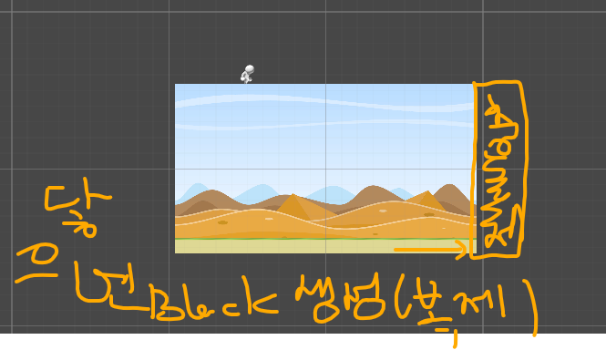</img>

- spriteRenderer를 꺼서 하얀 상자가 안보이게 만들어줌
- 오른쪽에 충돌체를 만들어서 블록이 닿으면 복제해서 땅을 생성해줌
    
    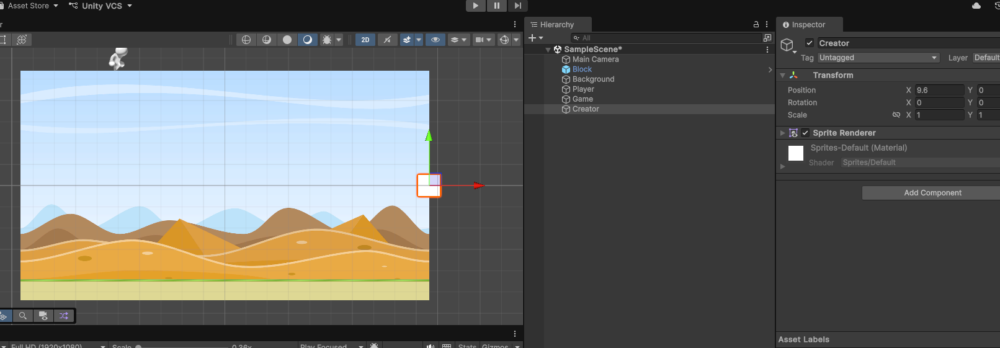</img>
    
- 위치 :
    - 화면 가로 크기 :  1920 / pixes per unit 100 = 19.2 / 2이 화면의 반의 끝 = 9.6 - 0.5 = 9.1
        - 100픽셀*100픽셀은 유니티에서의 1*1
    
    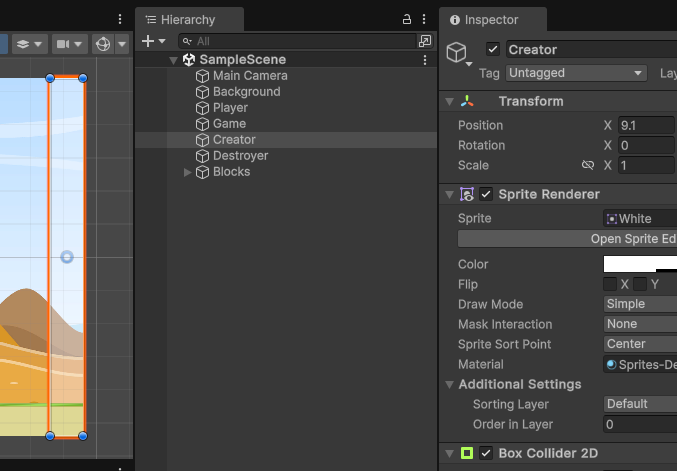</img>
    

```csharp
[SerializeField]//private 변수를 에디터에 노출 시켜줌
private GameObject blockPrefab;//파일에서 불러온 원본 프리팹

private GameObject blocks; //복제된 블록들을 담아둘 폴더 같은 거
```

- prefab : 게임 오브젝트를 미리 만들어서 파일로 저장해둔 것

```csharp
private void OnTriggerEnter2D(Collider2D collision)
{
    //print($"Trigger Enter : {collision.gameObject.name}");

    GameObject obj = Instantiate<GameObject>(blockPrefab, blocks.transform);
    obj.name = $"Block_{blocks.transform.childCount}"; //childCount : blocks의 자식의 개수 근데 이렇게 하면 나중에 똑같은 이름으로 된 애들이 계속 나옴

    float x = transform.position.x; //transform 컴포넌트만 미리 선언을 안해도 내부적으로 getComponent된 변수가 있음 //creator 위치

    x += 5.0f;//블록 간 간격

    if(collision.gameObject.name != "Block_Start")//부딪힌 블록이 Block Start가 아닐때만
        x += collision.transform.localScale.x; //이전에 충돌한 블록의 x 크기만큼 x좌표에 더해서 x좌표를 한칸 더 뒤로 미룸

		//게임 오브젝트의 로컬 x 좌표값만 변경
    Vector2 position = obj.transform.localPosition; //복제된 블록의 부모 기준 위치를 position에 저장
    position.x = x;//position의 x좌표만 새로 설정한 x값으로 저장
    obj.transform.localPosition = position;//수정된 position값을 복사된 블록의 로컬 위치에 할당하여 실제로 위치 변경
}
```

- 블록이 Creator를 관통해야 하기 때문에 IsTrigger 체크 : OnTriggerEnter2D / Collider2D 사용
- Instantiate<GameObject> : 프리팹이나 게임 오브젝트를 복사해 새로운 오브젝트를 화면에 만드는 기능
- 복사한 블록은 blocks의 child가 될거고 이름은 childCount를 써서 구분해줌
    - 이렇게 하면 블록이 사라지면서 child갯수가 일정해져서 계속 block6만 생김…
    - 블록의 개수를 count하는 int형 변수 선언 후 Creator에 블록이 부딪힐 때마다 카운
    
    ```csharp
    private int blockCount = 0;
    
    private void OnTriggerEnter2D(Collider2D collision)
    {
    		obj.name = $"Block_{++blockCount}";
    }
    ```
    

#### **[블록 간격]**

- 복사한 블록이 크리에이터와 맞닿아 있으면 무한 복사가 되기 때문에 간격을 설정함
    - transform 컴포넌트만 getComponent로 가져오지 않아도 내부적으로 getComponent된 변수가 있음 > Creator의 x좌표를 가져와서 x에 저장
    - creator 위치에서 5.0f만큼 간격을 줌
    - 부딪힌 블록이 Block Start가 아닐때만 충돌한 블록의 x 크기 만큼 x좌표에 더해줘서 뒤로 미룸.
    - 복사한 블록의 로컬 x 좌표값만 새로 설정한 float x의 x 값으로 변경
    
    ⇒ 근데 간격이 일정하면 노잼 → 블록 간의 간격을 랜덤하게 변경
    

```csharp
[SerializeField]
private Vector2 distance = new Vector2(4, 8);

private void OnTriggerEnter2D(Collider2D collision)
{
		```
		x += Random.Range(distance.x, distance.y);
		```
}
```

- Vector2 : x, y 좌표를 가진 자료형이지만 최소, 최댓값을 넣어 저장하는 방법으로도 많이 사용함.
- Random.Range(min, max) : min~max의 범위에서 난수 발생.
    - c#에서는 랜덤 객체를 new로 생성해서 사용했지만 유니티는 스태틱 함수로 사용 가능

#### [블록 크기]

블록의 크기도 랜덤한 크기로 바꿔줌

```csharp
[SerializeField]
private Vector2 size = new Vector2(10, 16);

private void OnTriggerEnter2D(Collider2D collision)
{
    //x += 6.0f(블록크기) * 0.5f;//블록 x 크기의 반만큼 위치를 조정 (블록의 간격을 보장하기 위함)
    float scaleX = Random.Range(size.x, size.y);
    x += scaleX * 0.5f;

    Vector2 scale = Vector2.one;//(1,1) 이제 이 스케일은 안씀. 스프라이트 렌더러랑 박스콜라이더 사이즈를 바꿔줄거임>이미지 늘어난거 없어지게 하려고
		scale.x = scaleX;
		obj.transform.localScale = scale;

}
```

- 블록 간격과 동일하게 랜덤 범위를 Vector2로 지정하고 Random.Range로 scaleX에 저장해주고 복제된 obj의 scale에 넣어주면 됨.
- 대신 이렇게 하면 일정해야하는 블록의 간격이 블록의 크기 때문에 줄어들거나 늘어나는 일이 발생하게 됨 ⇒ 블록의 크기와 관계없이 간격은 늘 일정해야함!
- 블록의 x좌표를 블록 크기의 반만큼 뒤로 이동시켜주면 블록의 끝에서 시작지점까지의 간격이 지정해준 블록의 간격만큼 유지가 됨

## [블록의 스피드]

```csharp
/*Game Script*/
[SerializeField, Range(5, 30)]
private float blockSpeed = 15.0f;
public float BlockSpeed => blockSpeed; //외부에서 사용 가능하도록 프로퍼티 생성
```

게임을 관리하는 게임 스크립트에 블록스피드를 선언하고 외부에서 사용 가능하게 프로퍼티 생성

```csharp
/*Block Script*/

transform.Translate(-game.BlockSpeed * Time.deltaTime, 0.0f, 0.0f);

```

## 캐릭터 회전 잠금

- 캐릭터가 자꾸 앞으로 굴러가는 거 막아줘야 함.

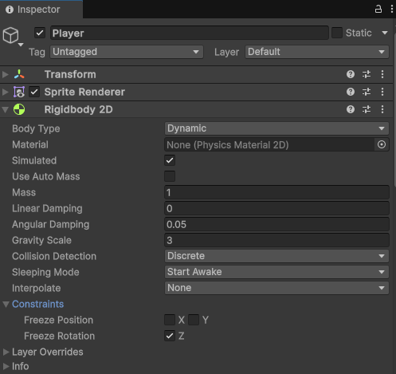</img>

- Player의 Rigidbody 2D의 Constraints에서 Freeze를 선택해줌.
- 플레이어는 지금 z축을 기준으로 자꾸 돌아가니까 z축을 잠궈준다.

## [블록의 이미지 늘어남]

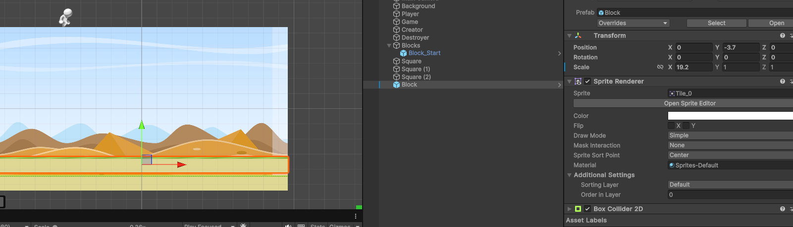</img>

- 블록의 sprite가 늘린 이미지처럼 되어있는 걸 수정해야 함.
    - SPRITE EDITOR - 파란선
        - SPRITE MODE - SINGE : 사진 한장만 사용(배경같은 단일 이미지는 싱글 사용)
        - MULTIPLE : 여러장 사용(하나의 이미지에서 여러개의 sprite를 만들수 있음)
    - SPRITE EDITOR - 초록선
        - 으로 둘러쌓여 있으면 크기가 가변
        - 이외의 구역은 고정

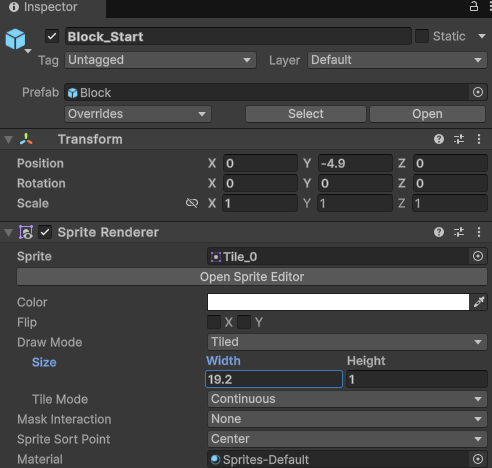</img>

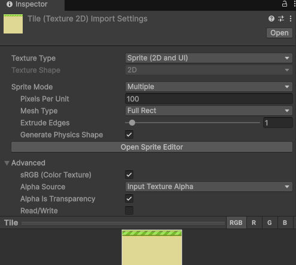</img>

- Block.SpriteRenderer - Draw Mode : Tiled
    - 스프라이트 모드 - 멀티플
    - 메쉬 타입 - 풀렉트
- 이렇게 해주면 타일 스프라이트를 타일처럼 다다다닥 박아서 블록의 윗부분이 정상적으로 나옴

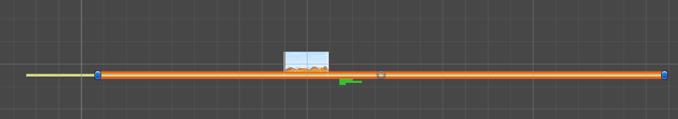</img>

- 블록의 이미지는 정상적으로 나오는데 게임 플레이 후 블록의 상태가….
    
    →블록 프리팹(원본)은 사이즈를 1,1로 하고 블록 스타트는 sprite renderer 사이즈를 19.2로 조정. 이후에 들어오는 블록들도 이미지 늘어남 방지를 위해 sprite renderer 랑 box collider 2D의 사이즈를 변경하는 것으로 수정
    

```csharp
//Vector2 scale = Vector2.one;//(1,1) 
//이제 이 스케일은 안씀. 스프라이트 렌더러랑 박스콜라이더 사이즈를 바꿔줄거임
//=>이미지 늘어난거 없어지게 하려고
//scale.x = scaleX;
//obj.transform.localScale = scale;

SpriteRenderer spriteRenderer = obj.GetComponent<SpriteRenderer>();//복제한 블록의 스프라이트 렌더러를 가져옴
spriteRenderer.size = new Vector2(scaleX, 1.0f);

BoxCollider2D boxCollider2D = obj.GetComponent<BoxCollider2D>();//박스 콜라이더도 크기에 맞춰서 바꿔줌
boxCollider2D.size = new Vector2(scaleX, 1.0f);
```

- 수정 후 : 간격 어디갔냐

!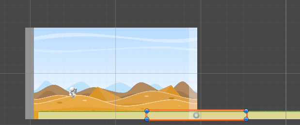</img>

- 로컬 스케일을 사용해서 간격을 조절했는데 로컬 스케일이 없어져서 간격이 없어진거임.
    
    →Sprite Renderer로 간격 조절 필요
    
    ```csharp
    if(collision.gameObject.name != "Block_Start")//최초 블록이 아니라면
    {
        //x += collision.transform.localScale.x; //이전에 충돌한 블록의 크기만큼 x 크기에 더함
    
        x += collision.GetComponent<SpriteRenderer>().size.x;//충돌체의 SpriteRenderer의 크기의 x값만큼
    
    }
    ```
    

## [블록의 높이]

- 블록의 높이도 랜덤하게 바뀌도록 만들어 보자

```csharp
[SerializeField]
private Vector2 height = new Vector2(1, 5);
```

- 우선 높이가 될 height 변수를 선언 후 1, 5의 최소, 최대값을 설정함(에디터에서 변경 가능)

```csharp
int scaleY = Random.Range((int)height.x, (int)height.y + 1);
//높이는 float형 말고 1, 2, 3 이런식으로 딱 배수로만 될수 있게 int형으로 Casting
//대신 int형으로 casting할 경우 범위가 최소~최대-1이 됨. +1해줘야 설정한 최대값까지 나옴

SpriteRenderer spriteRenderer = obj.GetComponent<SpriteRenderer>();//복제한 블록의 스프라이트 렌더러를 가져옴
spriteRenderer.size = new Vector2(scaleX, scaleY);

BoxCollider2D boxCollider2D = obj.GetComponent<BoxCollider2D>();
boxCollider2D.size = new Vector2(scaleX, scaleY);
```

- scaleY에 랜덤으로 생성한 값을 대입하고 spriteRenderer의 size와 boxCollider2D의 size에 대입해줌.
- 그렇게 되면 사이즈는 커지지만 블록의 중심을 기준으로 사이즈가 커지고 블록이 여러겹으로 쌓인 것처럼 나옴.

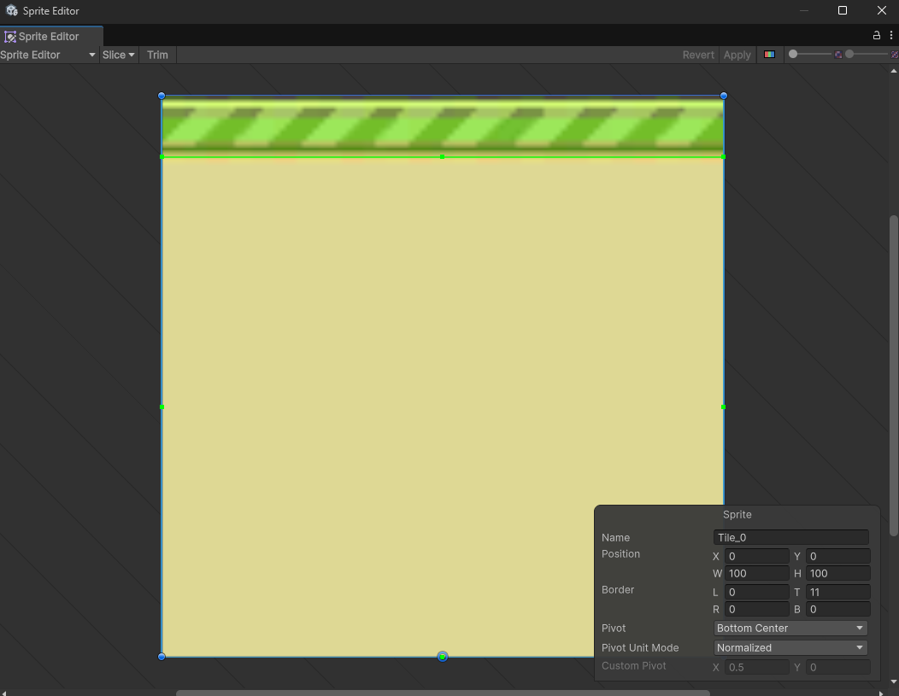</img>

- Tile의 Sprite Editor에서 늘어나도 되는 노란 부분은 초록색 선으로 감싸줌
- pivot을 Center→Bottom Center로 변경
- 블록의 높이를 0.5만큼 내려줌

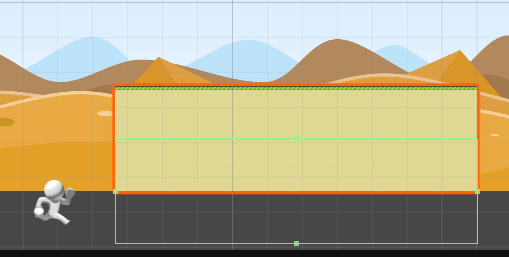</img>

- Sprite는 정상적으로 나오지만 boxCollider는 여전히 아래로 내려가 있음 → box Collider는 pivot에 영향을 받지 않기 때문
    - offset : 충돌 영역(초록색 박스)의 중심 위치를 게임 오브젝트의 피벗(Pivot, 중심점) 기준으로 이동시키는 기능
    - Block Start는 임의로 offset을 0.5만큼 올려주고 복제되는 블록들은 블록 높이의 반만큼 offset을 설정해줌.

```csharp
boxCollider2D.offset = new Vector2(0.0f, scaleY * 0.5f);
```

[유니티]
preference → 에디터 전체에 대한 설정
project setting → 이 프로젝트에 대한 설정

## 배경 움직이기

- 횡스크롤 게임에서는 블록의 속도보다 뒤 이미지의 속도가 느리게 흘러가게 함 → 자연스러움
- 배경을 하나 복제해서 두개의 배경을 나란히 두고 천천히 움직이다 처음 배경이 화면을 완전히 벗어나면 다시 원위치를 시켜줌.
- Mathf.Repeat(float a, float b) : a가 0~b사이를 계속 반복하도록 만들어주는 함수(%연산)
    - %연산자로 나머지를 반환하는 것과 비슷하지만 Mathf.Repeat은 음수 처리 가능

```csharp
private SpriteRenderer spriteRenderer;
private float spriteSize;

private Vector3 start;
private void Awake()
{
    spriteRenderer = GetComponent<SpriteRenderer>();//배경의 SpriteRenderer를 가져옴
    spriteSize = spriteRenderer.localBounds.size.x;//spriteSize에 원본 이미지 가로 길이를 입력
    start = transform.position; //처음 시작 위치를 start에 저장
}

private void Update()
{
    float x = Mathf.Repeat(Time.time * 3.0f, spriteSize);//게임 실행 후 경과된 시간*3배(이동속도) 가 spriteSize에 도달하면 초기화
    transform.position = start + Vector3.left * x;//이미지의 처음 위치에서 왼쪽으로 x만큼 이동
}
```

- localBounds : 스케일(Transform Scale)이나 회전, 월드 위치의 영향을 받지 않은 스프라이트 에셋 순수의 영역 정보